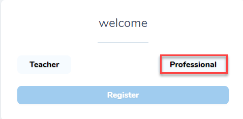
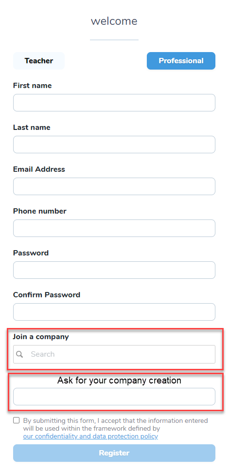
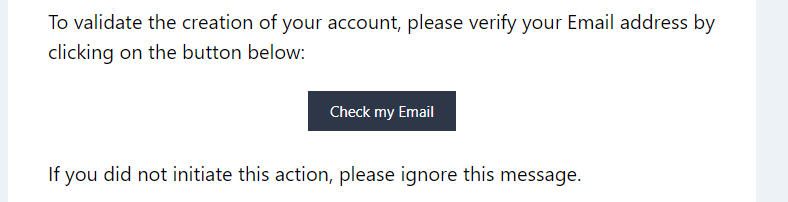

# Get access to oktonine
A company representative/employee can creates an account in Oktonine, by following these steps:

- As a professionnal (a company representative), when you come to this page, you need to click on `Register`

- Click on `Professionnal`

- Fill the form and search for your company. If your company is not already registred at oktonine, use the last field to put its name.

- You get a message telling you that your account needs to be validated by Oktonine within 48 hours. 

- At the same time you will receive an email asking you to verify your email adress

- Click on `Check my Email`
- When your account is validated by oktonine you should receive an email like that :

Note : If you don't receive any message from us after this delay and if you can't access to your account, we invite you to contact us.