# Submit a challenge

## Submit a challenge to a call-for-challenges

If you want to submit a challenge to a school, within their call-for-challenges, go to `Calls` at the left menu
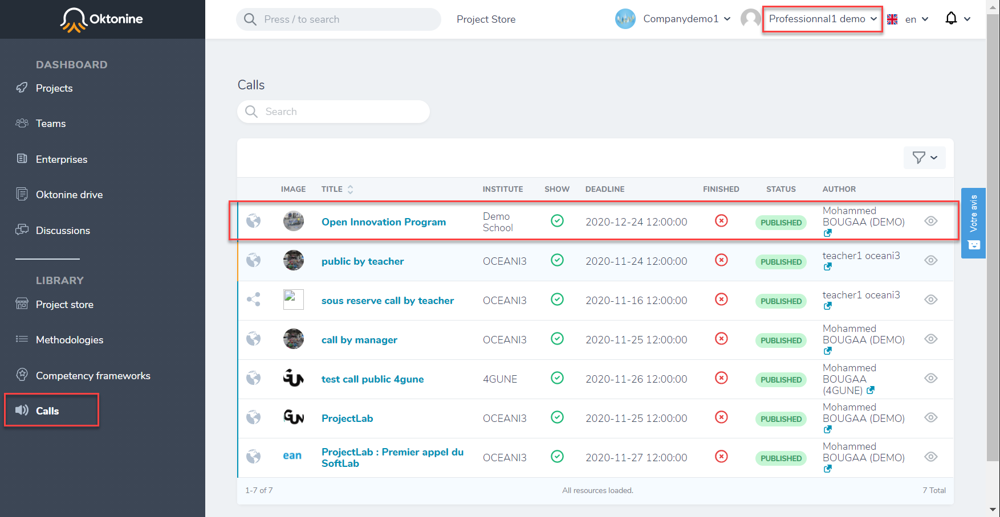

Open the targeted `Call for challenges`

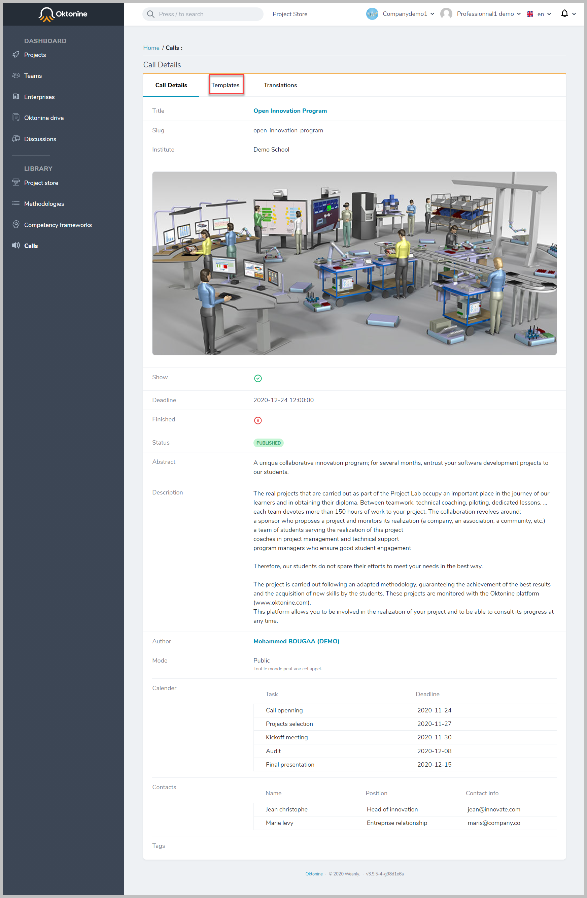

Go to the `Challenges` tab, and click on `Propose a challenge.`

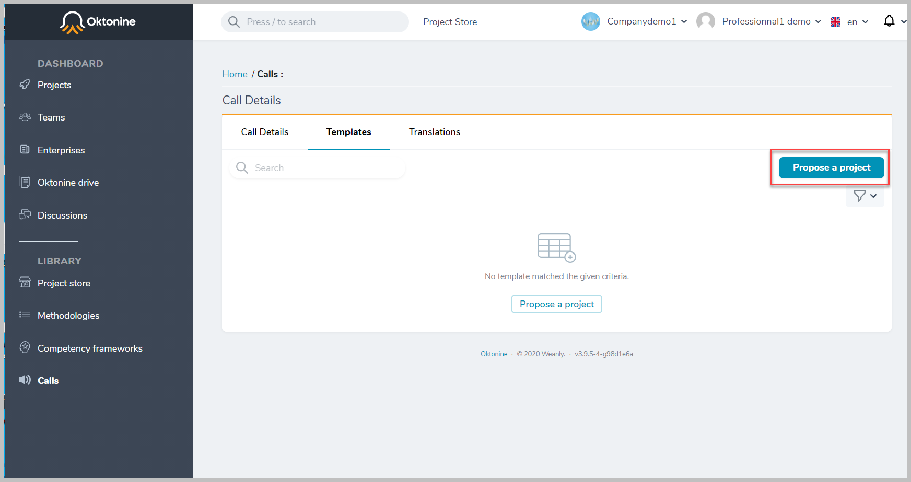

Fill in the challenge submission form and click on `create a challenge.`

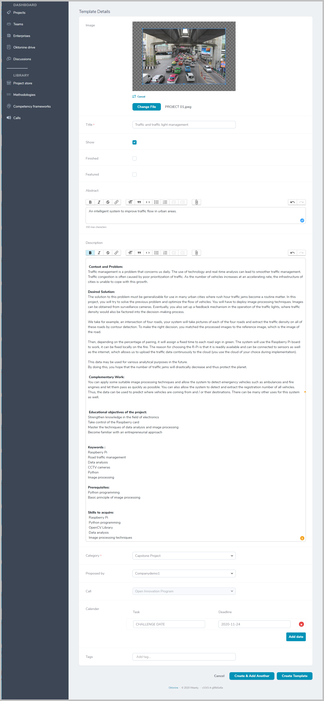

The created challenge will appear at the `Challenges` tab.

Note: This challenge will be visible for the targeted school only once it has been validated by the Oktonine team

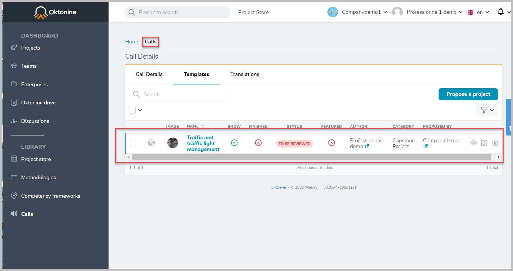

## Submit a challenge using the ProjectStore

The other way to submit a challenge is by doing it through the `project store.`

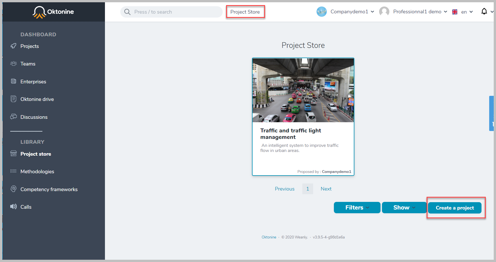

By filling the submission form, you need to tell if your challenge will be public, private, or on-demand.

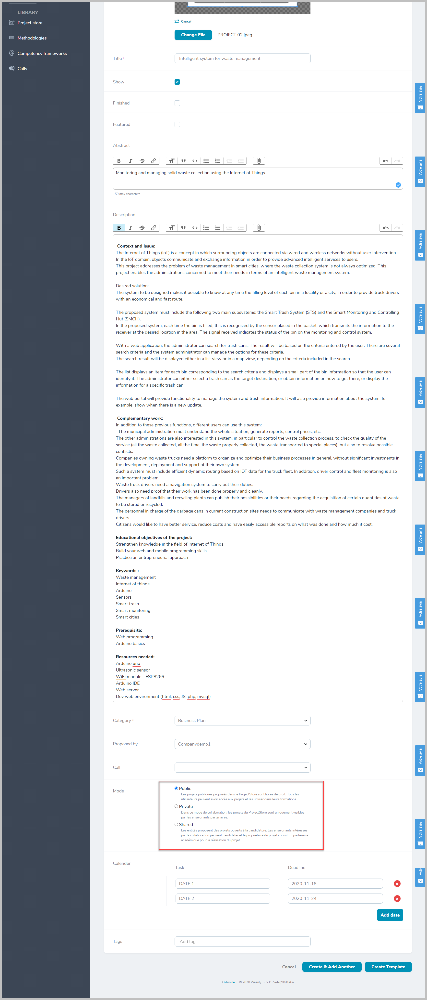

You can then: 

- Add a methodology to the challenge

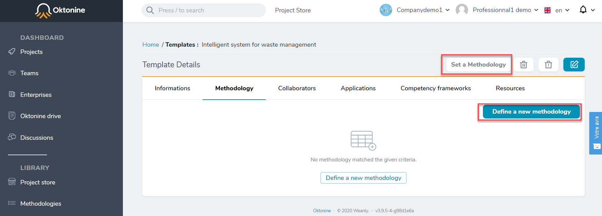

- Add collaborators

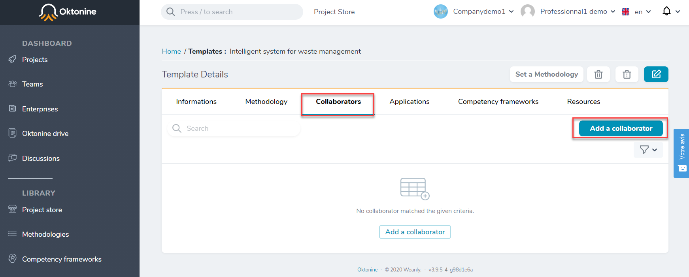

- Add a competency framework to it

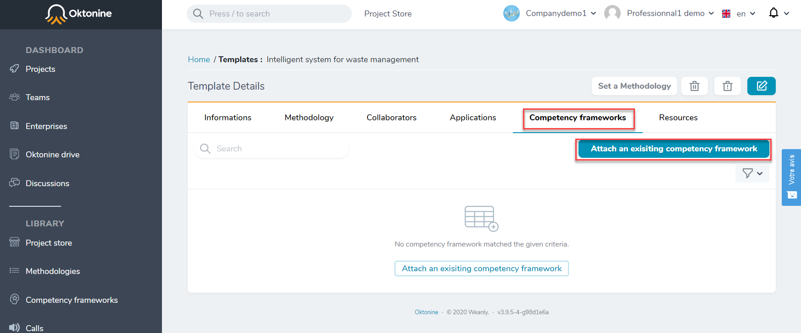

- Finally, you can add resources to your challenges

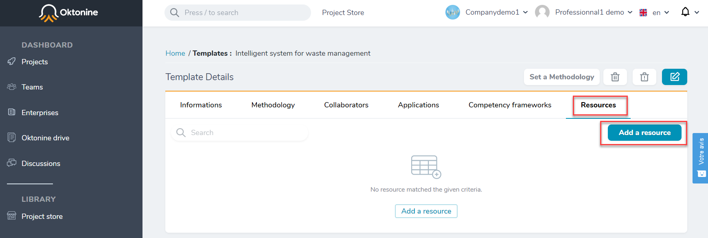
