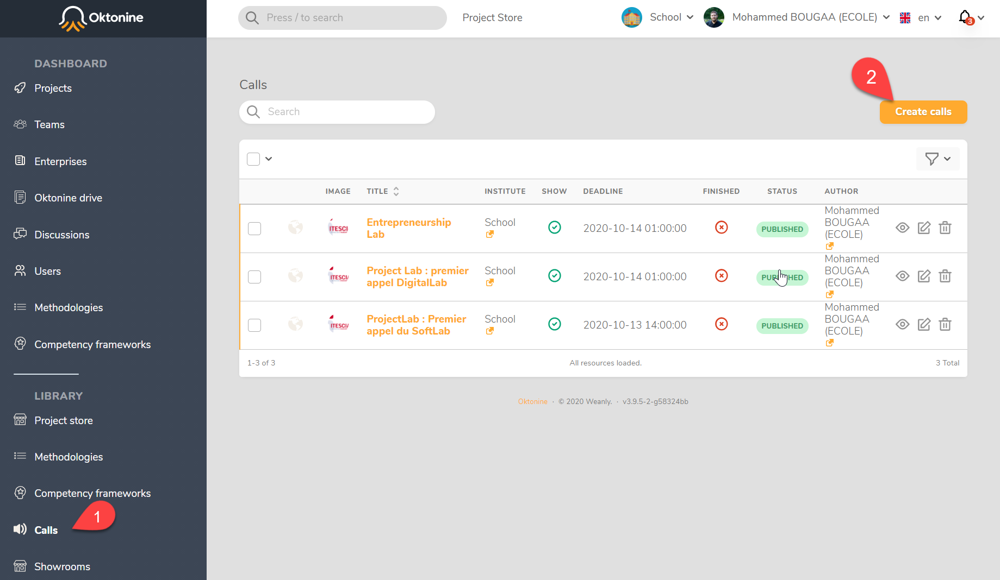
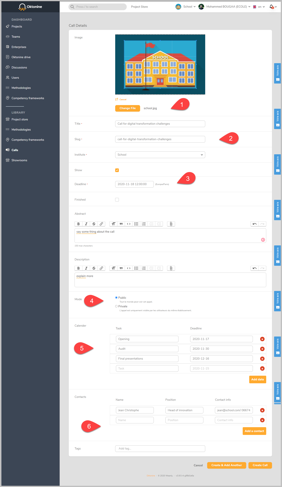
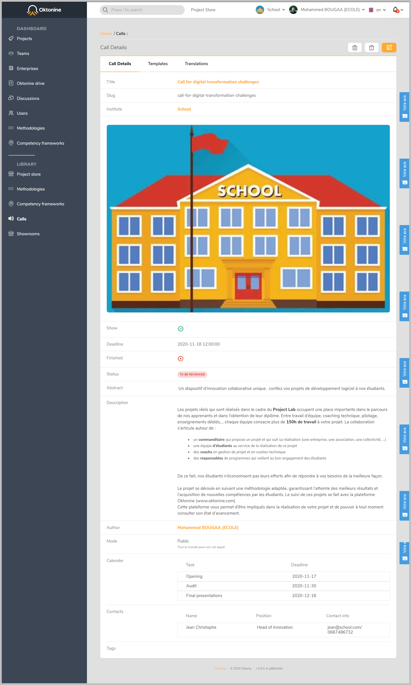
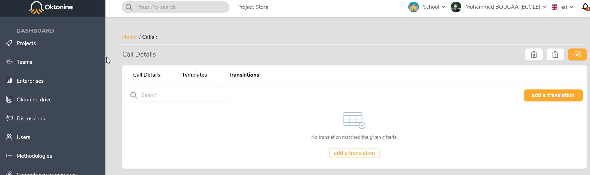
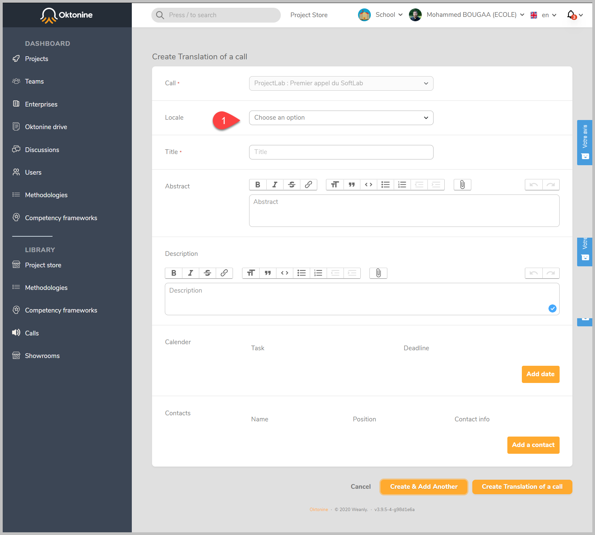
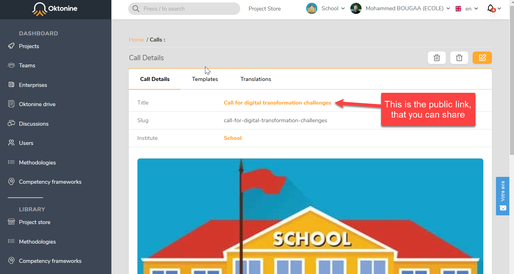
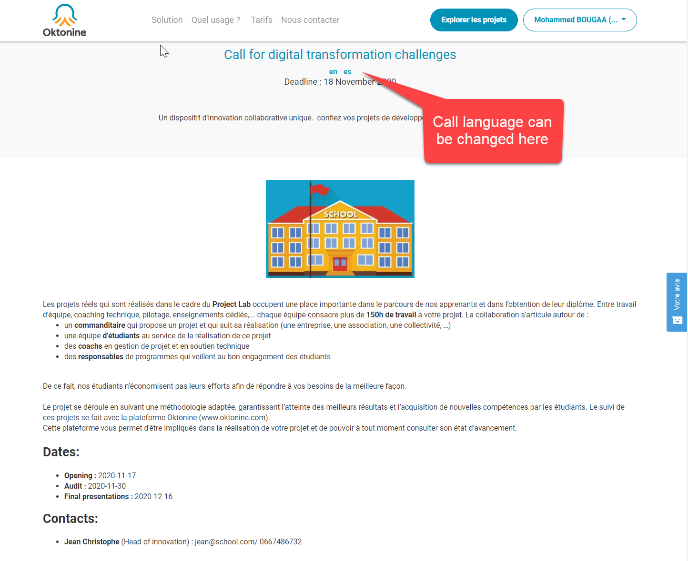
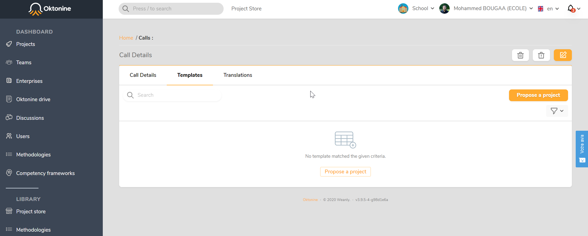
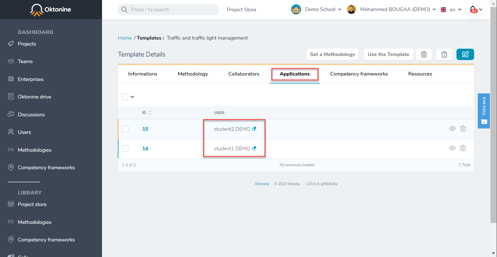

# Create a call-for-challenges
When you use oktonine to make your students work on real life projects, in collaboration with companies, one of the challenges is to find these projects for you students.

By using Oktonine you can pass through the `projectstore` to find these projects (we talk about that in another section), or you create your own call for challenges, that you can send to companies, this is the subject of this topic.

## Create a call
To create a call for challenges, you need to pass through these steps :

- Click on "calls" in the left menu --> all the calls created by your institution are available here

 

- Then, click on create a call, this screen appears, and asks you to fill the information of your call.

 

- When saved, the call looks like that :

 

## Translate the call into different languages
- To add different translations of your call, you can go to `Translations`, then click on `Add a translation`

 
 
- Then, by filling this form :

 

## Publish the call

- When the call is created, it needs to be reviewed and approvec by Oktonine's team.

- When validated you can share the call using it's public link 

 

- The call's public page will appears like that :

 

## Receiving challenges

- When you publish the call, you receive companies' challenges at this Tab :

 

 

## Manage students applications for the received challenges 

- Go to the list of received challenges
- Open a challenge
- Go to `Applications` Tab

 