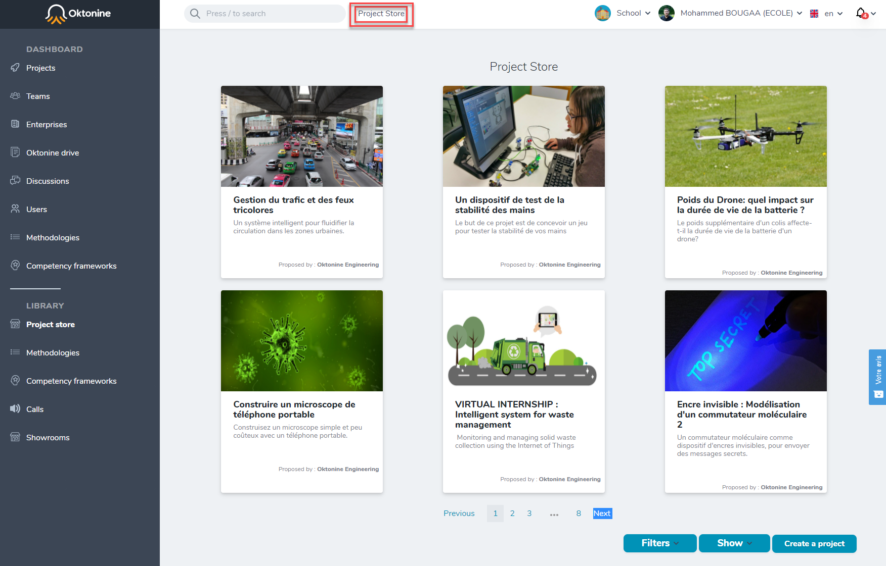
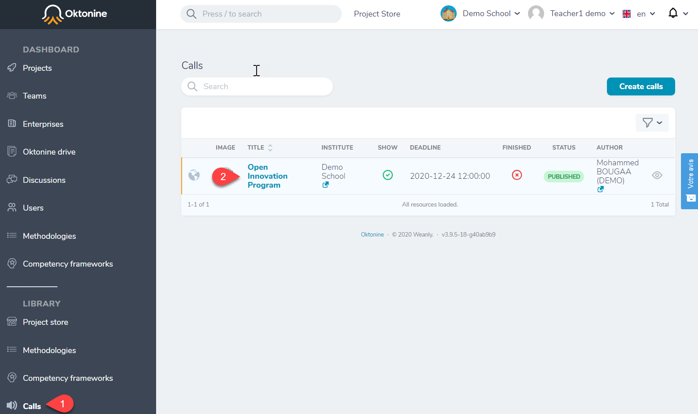
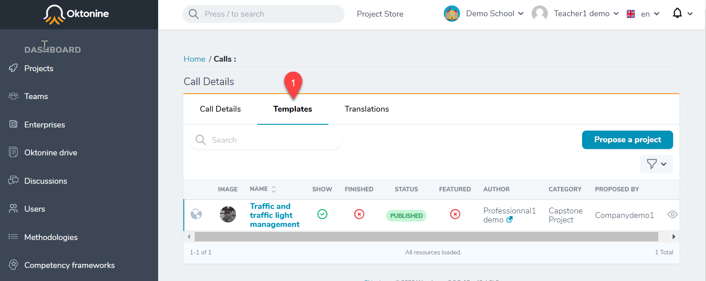

# Visualize and manage received challenges from a company

As a teacher or a school's manager, you can receive challenges from companies within two locations:

- Inside a call: if you published one and if you asked companies to submit their challenges inside it

- Inside the `ProjectStore`: If you didn't create a call-for-challenges or if you are looking for public challenges, open to all.

## Visualizing challenges within the `Project Store.`

On top of your Oktonine space, click on `Project Store.` 
You will find all the `Public` and `On-demand` challenges, in addition to the private challenges shared with your institution.
You can use the filter feature to refine the challenges displaying. 

## Visualizing challenges within a call-for-challenges

To visualize the challenges received for each call-for-challenges, go to the `Call` element of your menu.

By opening a call, you find all the received challenges within the `Challenges` tab.

