# Create a competency framework

A competency framework is a means by which institutions illustrate and organize which skills and competencies are addressed and rewarded by their curriculums.
You can create specific competency frameworks for your institution or use existing ones.

## Create a new competency framework
To create a new competency framework for your institute or a for a specific curriculum :
- Click on `competency frameworks` at the left menu (at the Library part)
- Then, click on `Create a new competency framework.`

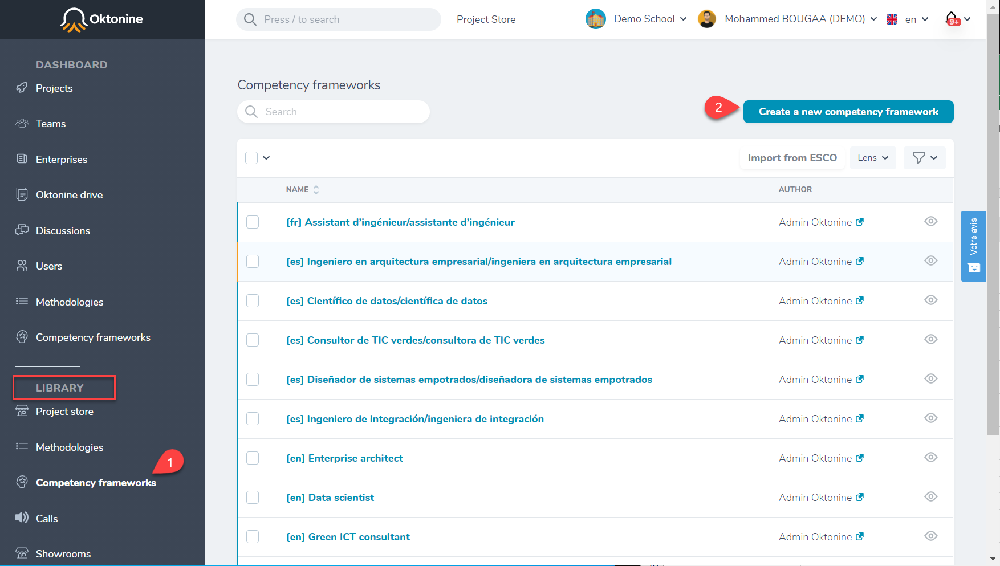

At the next window, give it a name and a description and click on `Create a competency framework.`

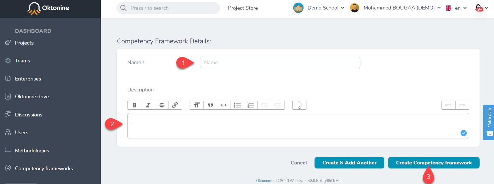

Go then to the `Competencies` tab and click on `Add competency` to define the different competencies that will compose your competency framework.

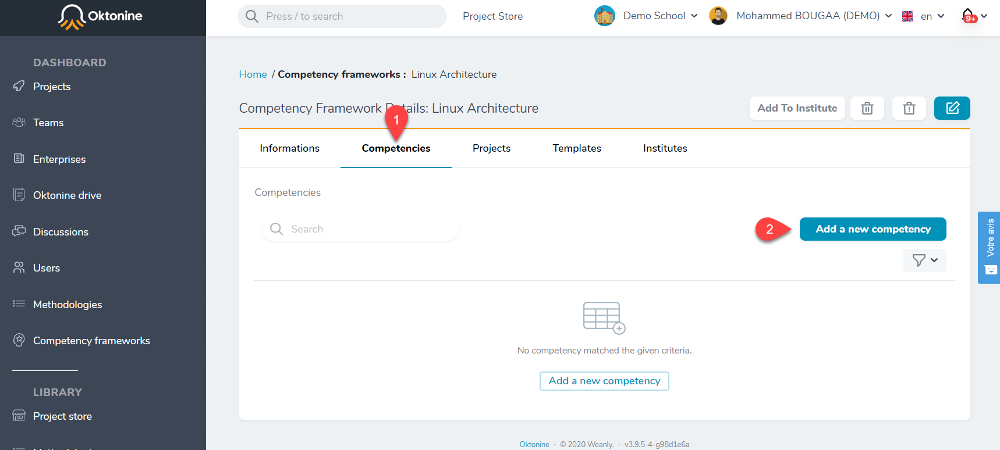

Give a name and a description of the competency you want to add to your framework. Repeat the operation to add all the competencies.

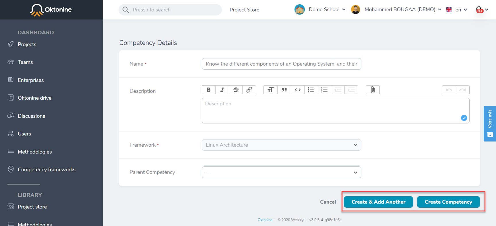

You can also open each competency to add sub-competencies to it

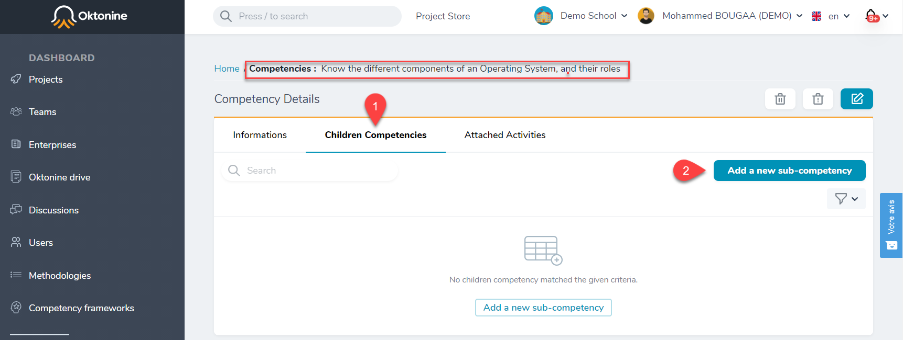

When you add all your competencies, the competency framework will look like that :

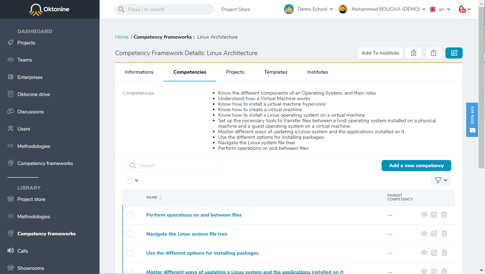

Click on `Add to institute` to make this new framework part of your institute.

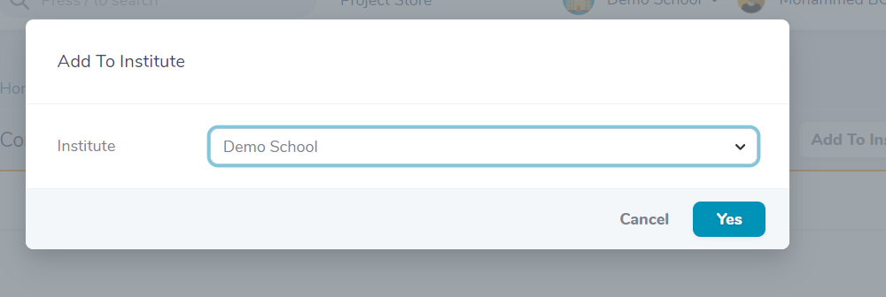

The created competency framework will be added to your institute space

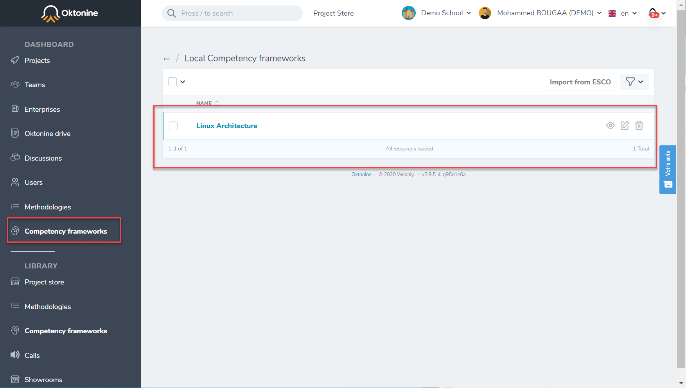

## Use an existing competency framework

You can also add any existing competency framework from the library.
Open the competency framework you want to add to your institute.

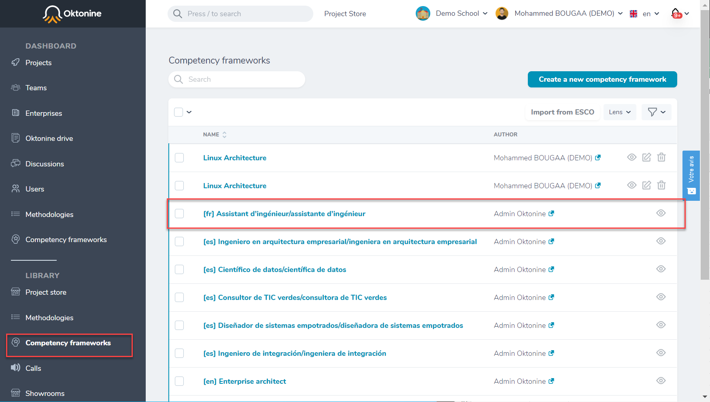

Click on `Add to institute`

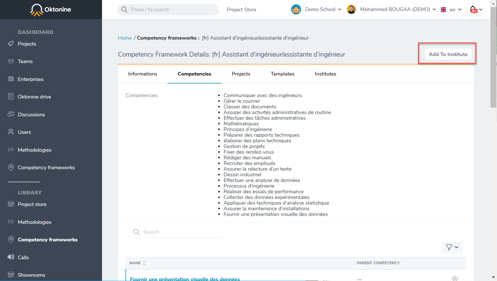

Select your institute from the list

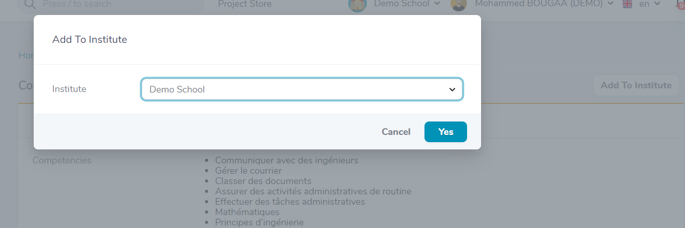

The competency framework is added to your institute

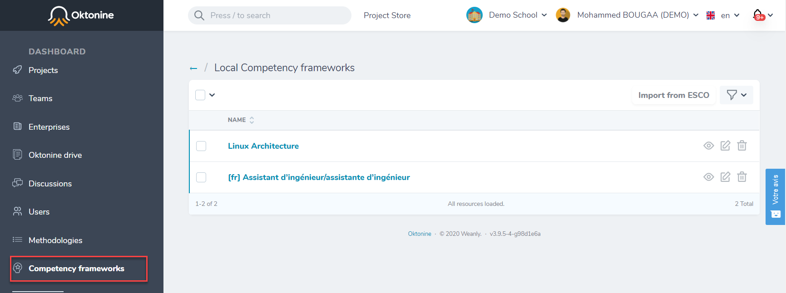

## Use ESCO competency frameworks

To add a new competency framework from ESCO, please follow these steps :

- Go to https://ec.europa.eu/esco/portal/occupation
- Use the navigation tree to search for a competency framework by profession

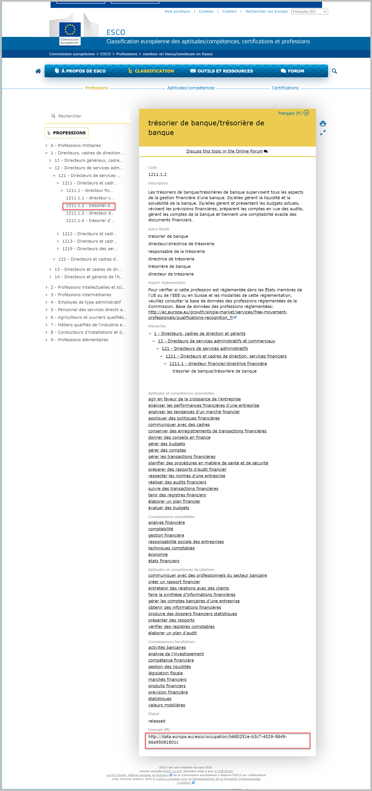

- Copy the URI of this framework

- Open the `Competency frameworks` menu and click on `Import from ESCO`

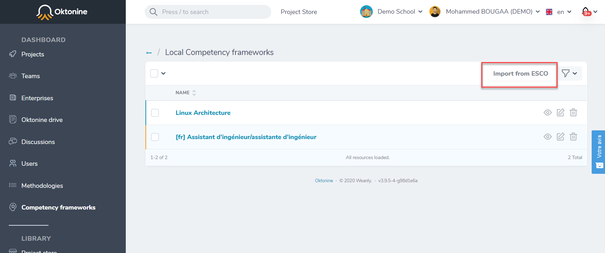

- Paste the URI you copied

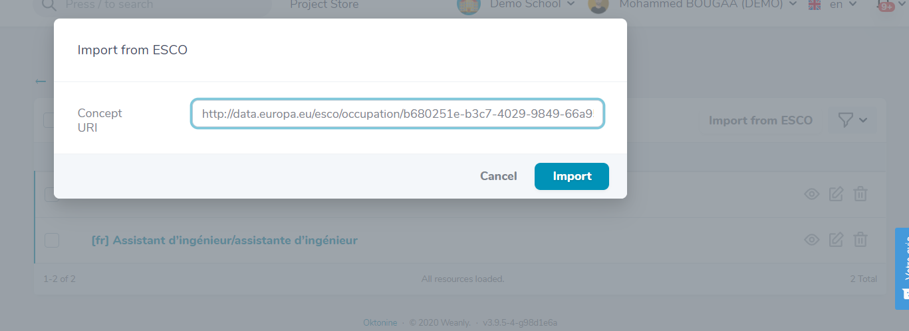

- Verify if the competency framework has been added successfully

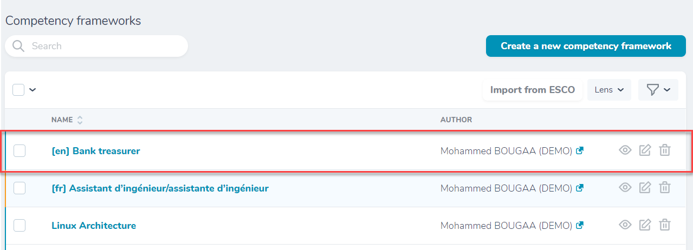
