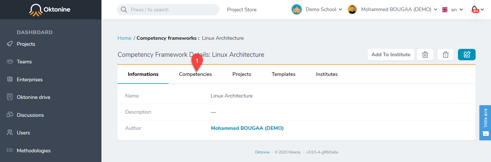

# Create a competency framework

## Create a new competency framework

## Use an existing competency framework

You can also add any existing competency framework from the library

## Use ESCO competency frameworks

To add a new competency framework from ESCO, please follow these steps :

- Go to : https://ec.europa.eu/esco/portal/occupation
- Use the navigation tree to search for a competency framework by profession

- Copy the URI of this framework

- Open the `Competency frameworks` menu and click on `Import from ESCO`

- Paste the URI you copied

- Verify if the competency framework has been added successfully

