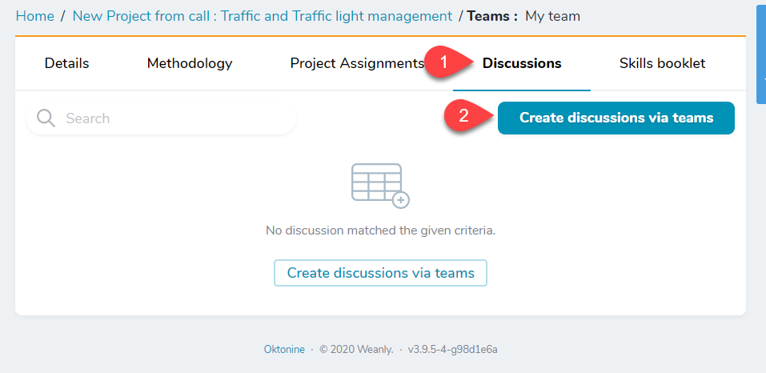
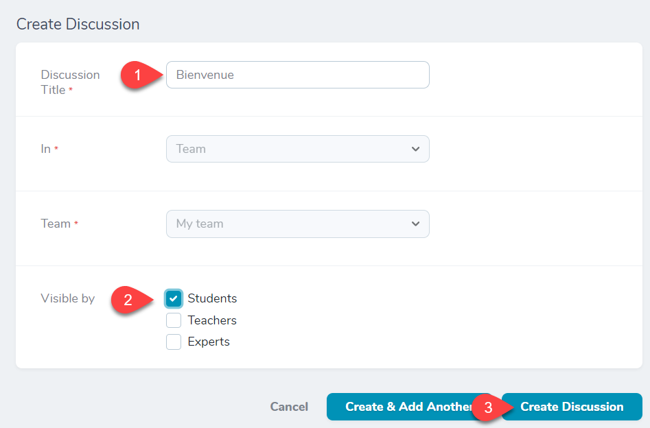
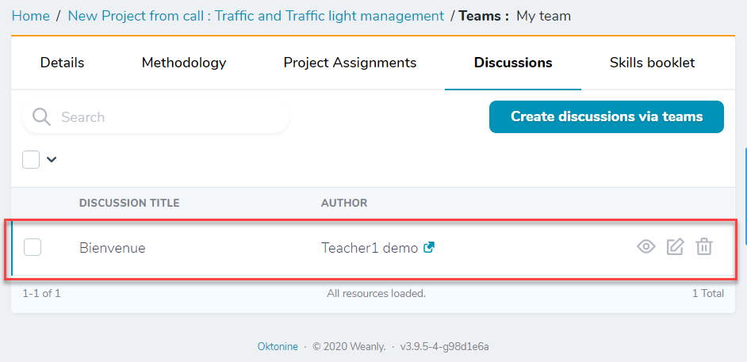
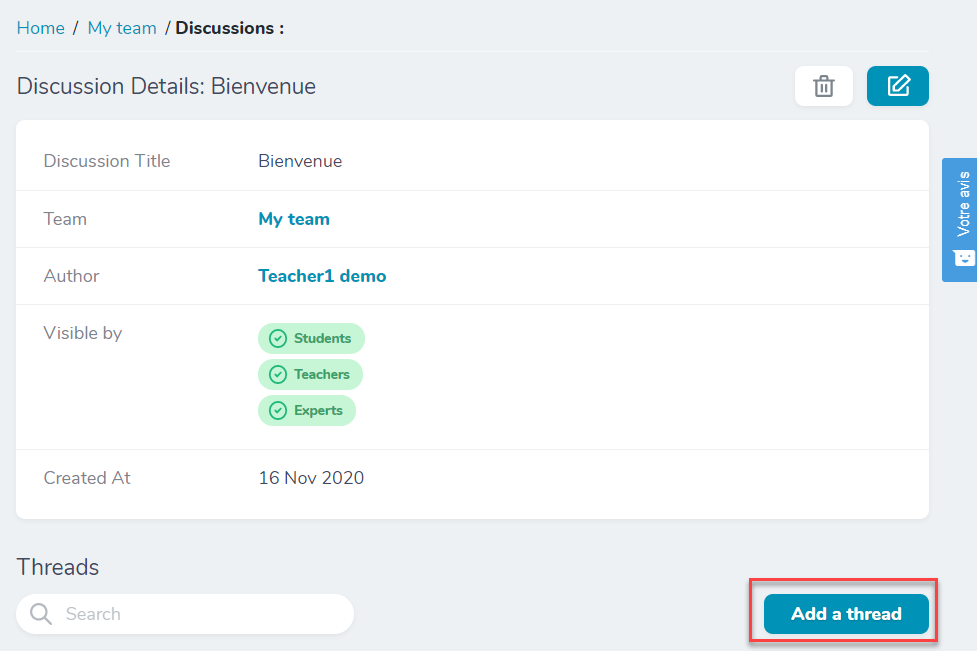
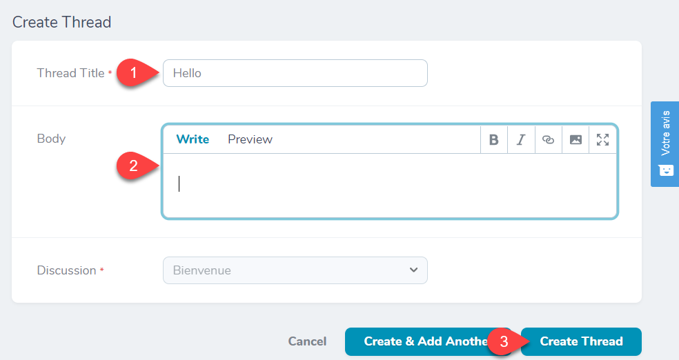
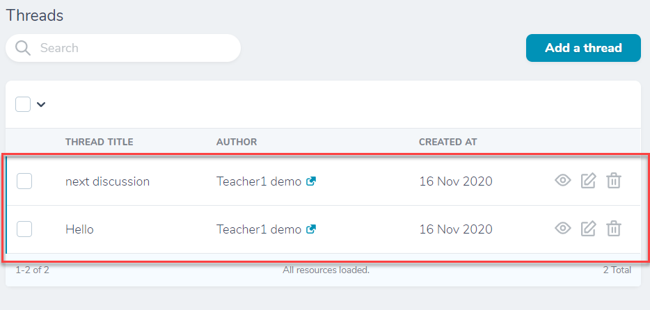
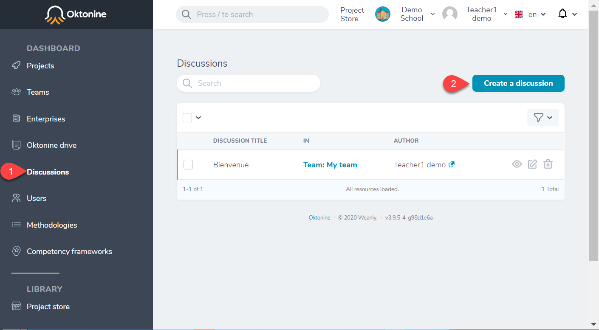
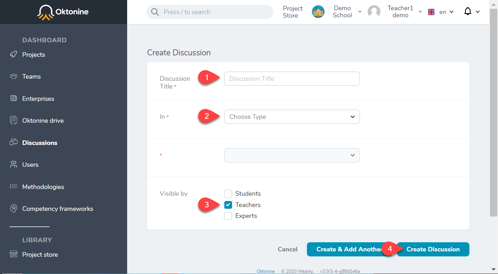

# Discussions

## Open a discussion with a team of students

If you want to communicate with your team, you can open a new discussion from the team's `discussions` tab.

To create a new discussion, give it a name, and indicate who can access it.

At any time, you can access your discussions with the team.

By opening a discussion, you can create one or more threads attached to it.

## Open a discussion with students, teachers, or enterprises

If you want to open a discussion with certain types of users (teachers, enterprises, or students). Click then on `Create a discussion.`

Give it a title, select your institute, and indicate who can see it

[//]: # (## Send an Email to a student)
