# Create and manage projects within the school environment

To create a project for your students, you have two choices:

- Create a project from a real-life challenge provided by a company, through the ProjectStore or the call-for-challenges

- Create your own project within the institute environment.

## Create a project from a challenge

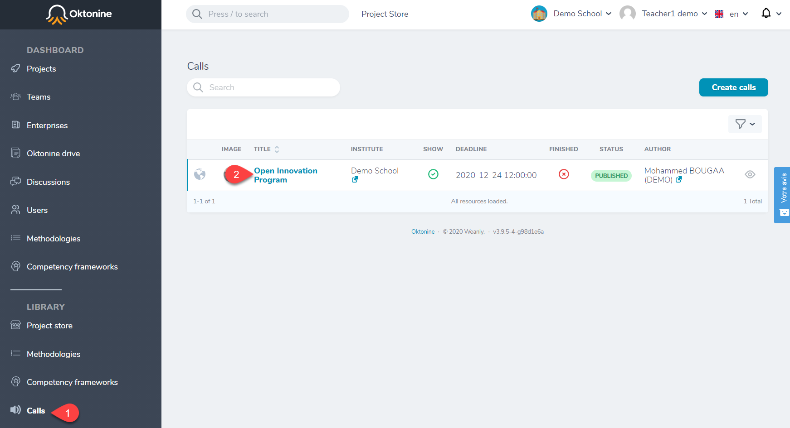

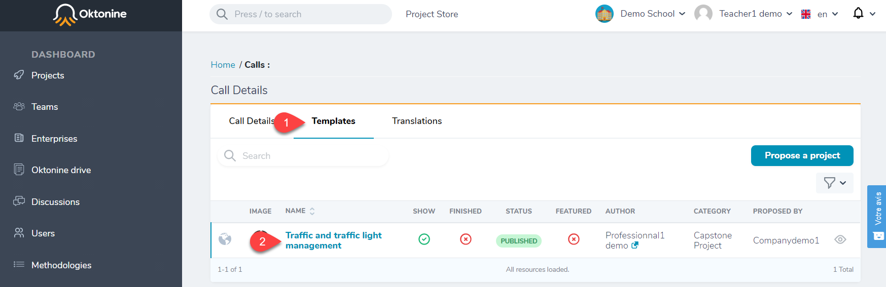

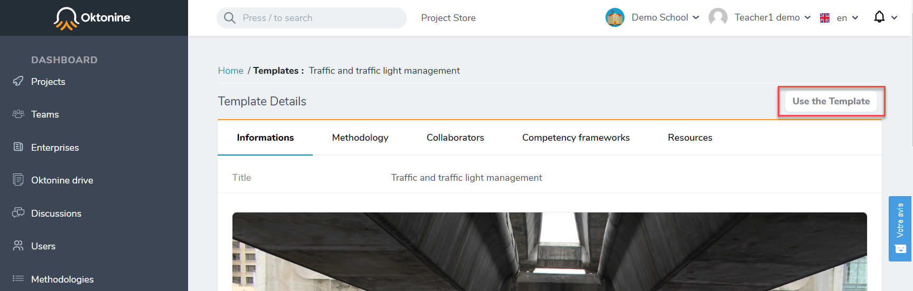

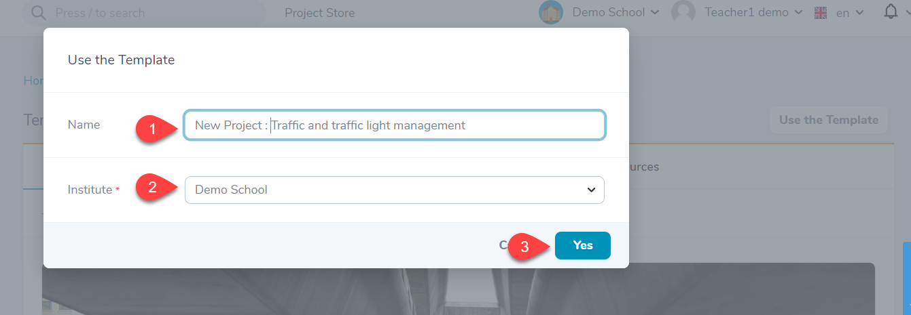

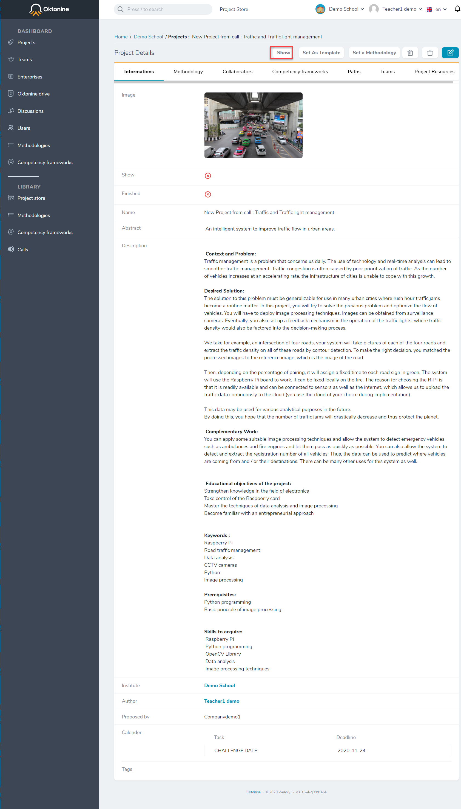

## Create a new project

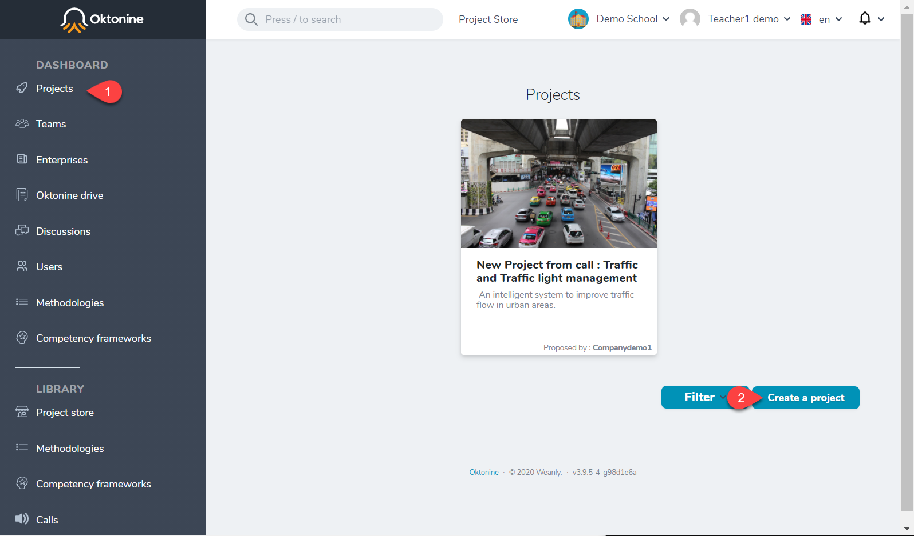

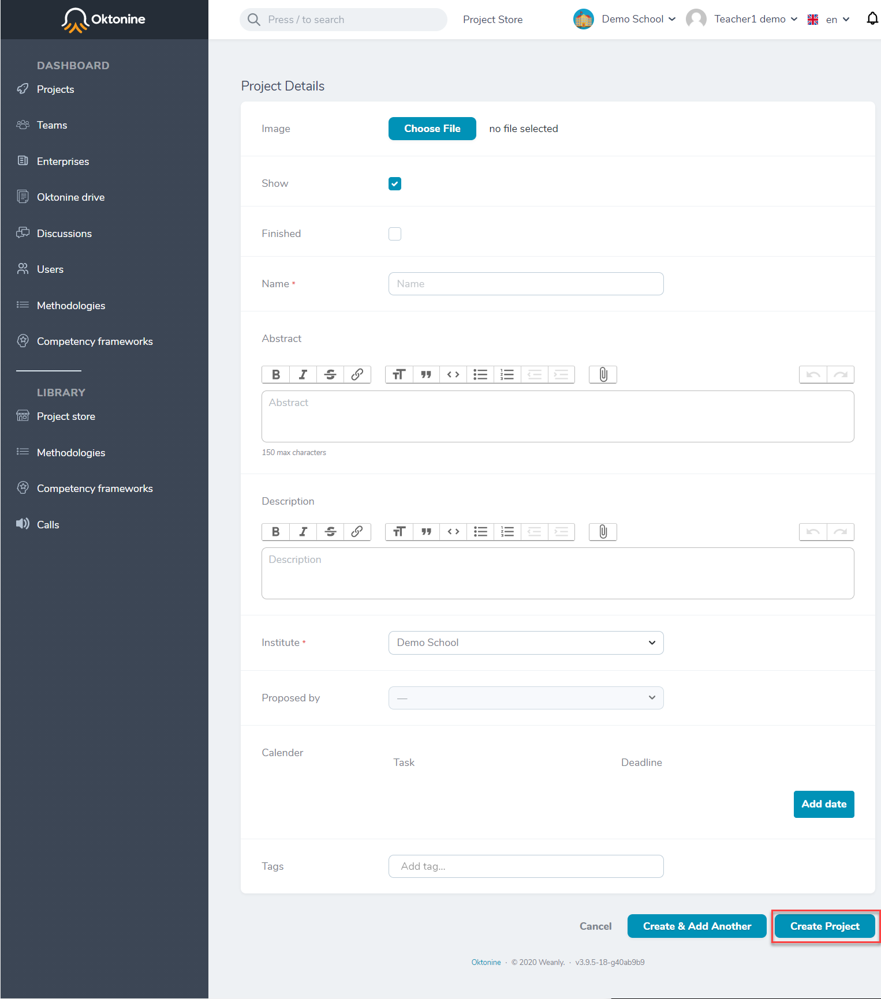

Now, you finished the project creation, you have to do some additionnal actions : 

## Assign a methodology to a project

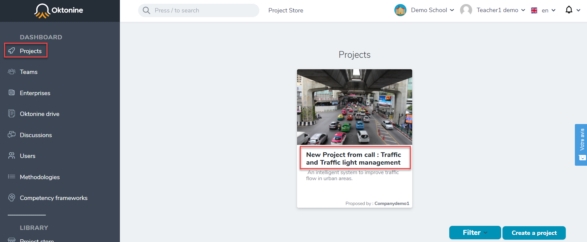

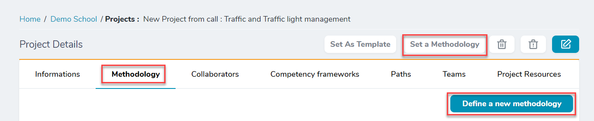

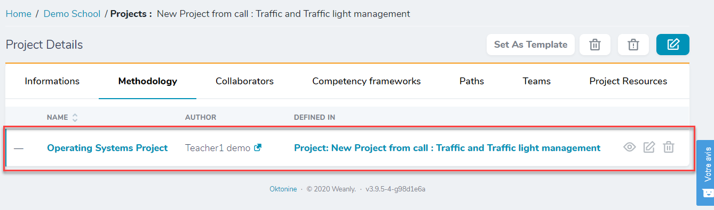

## Assign a competency framework to a project

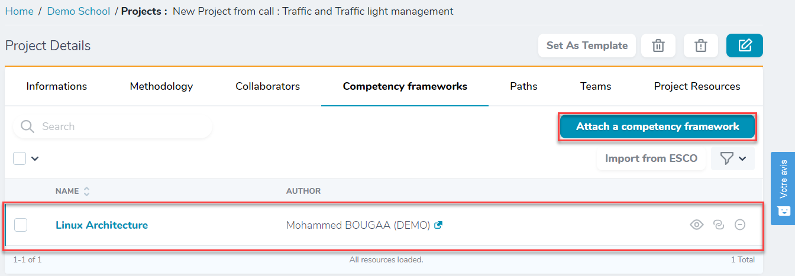

## Assign collaborators to a project

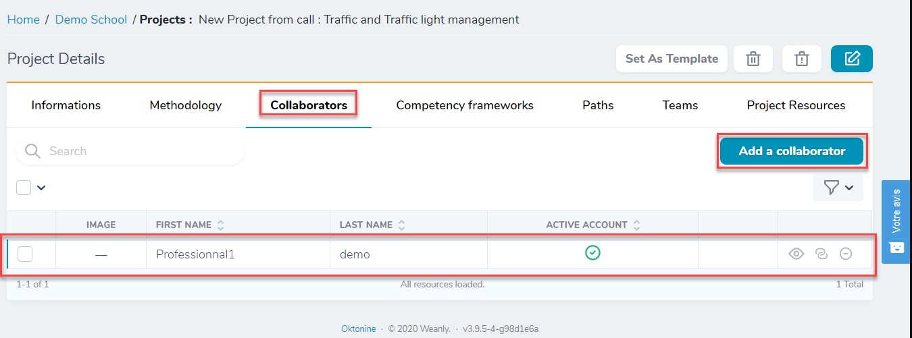

## Assign resources to a project

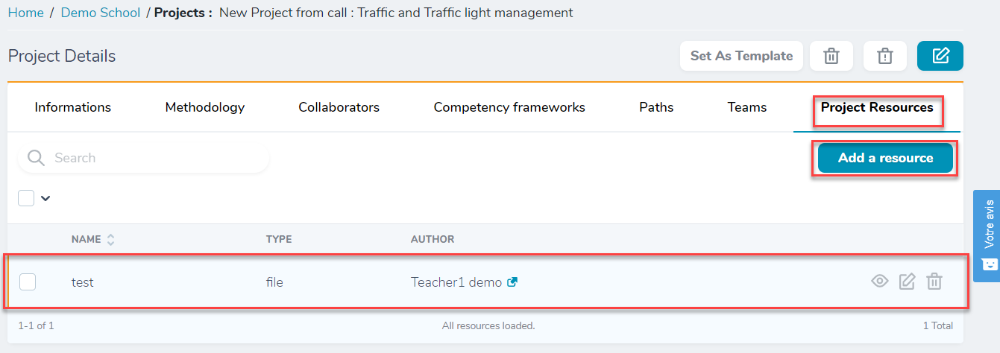

## Assign competencies to the different activities of the methodology (inside a project)

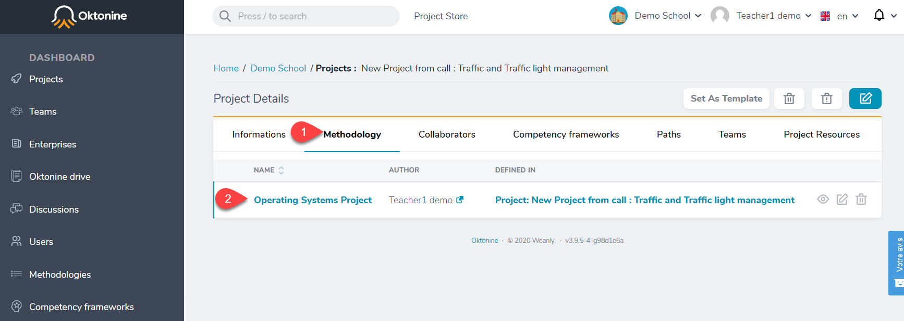

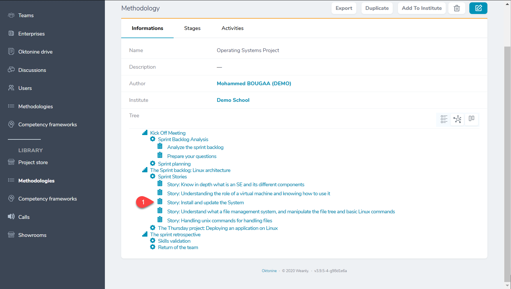

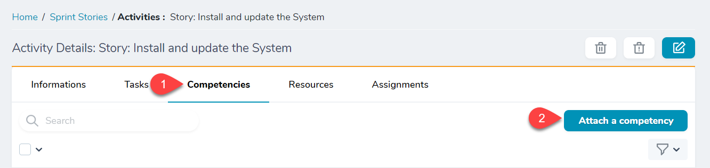

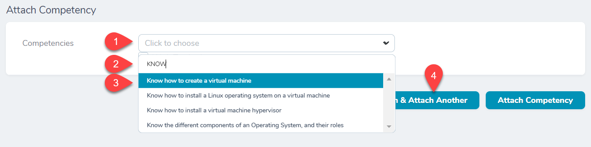

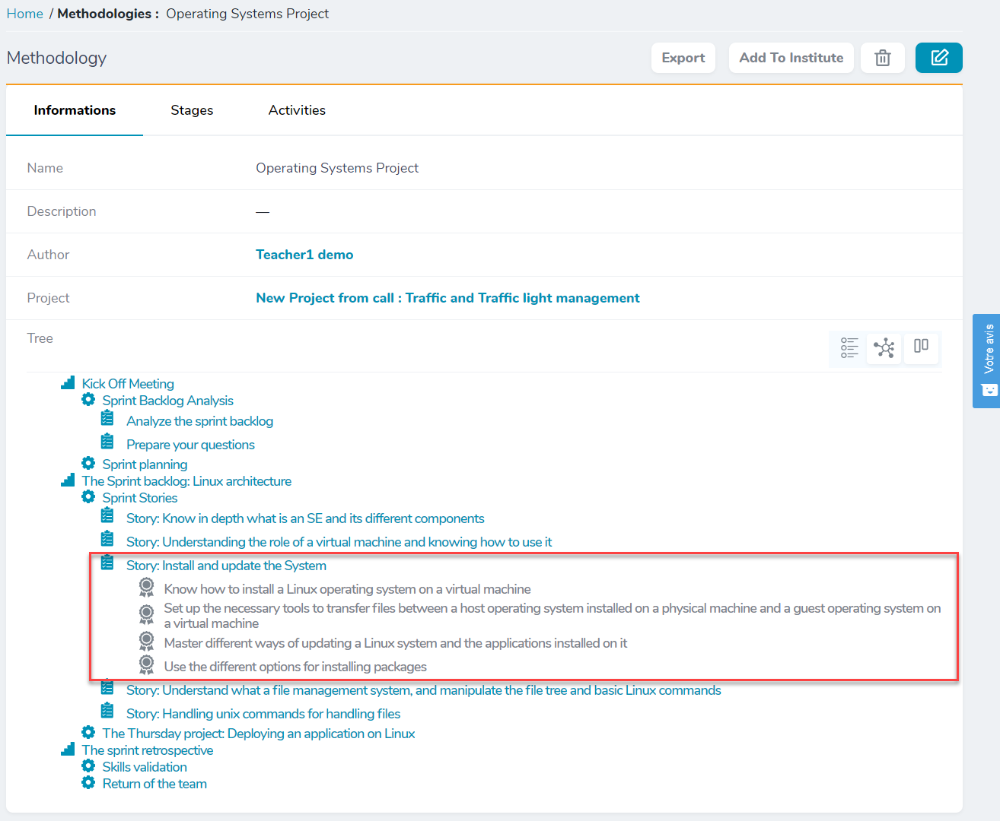