# Create and manage teams

For each project, you can create one or more teams to work on it.

## Create a new team within a project

To create a new team for your project, go to the `Projects` element of the menu, and open your project.

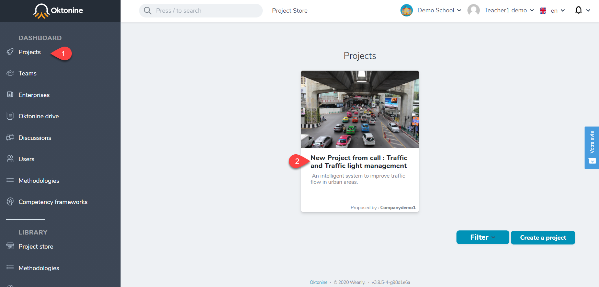

Go then to the `teams` tab and click on `Add a team to the project.`

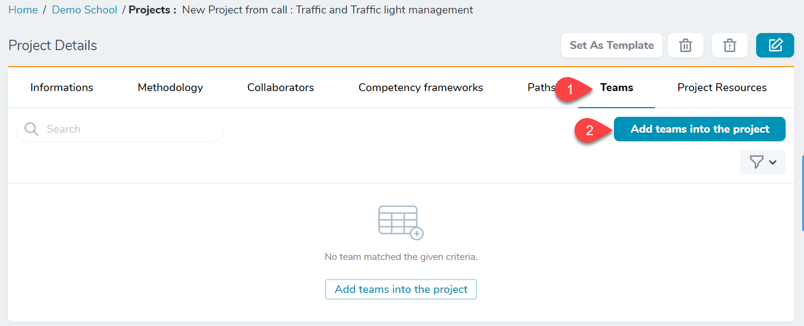

Give a name to the team and click on `create` or on `create and create another` to add another team.

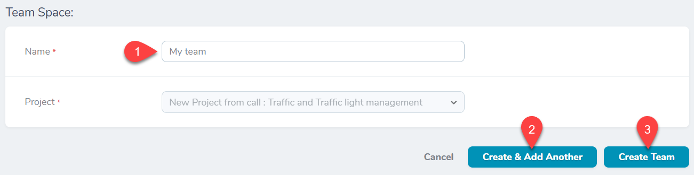

## Assign students to a team

Once a team is added to a project, you have to assign students to it. Click on the `+` icon to do that.

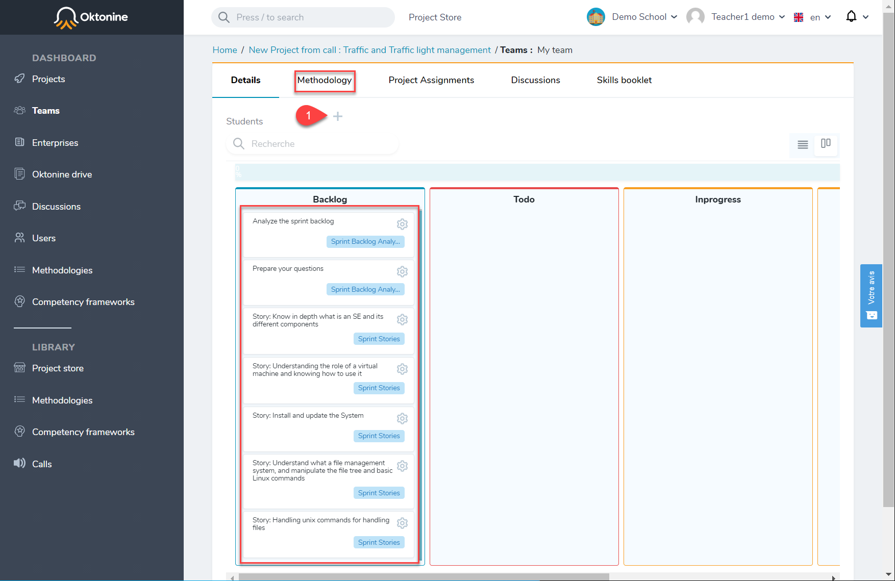
(Note that the methodology you already assigned to the project will be automatically added for each new team. Its activities will be automatically added to the `backlog` tab.) 

You can search for students you want to add one by one.
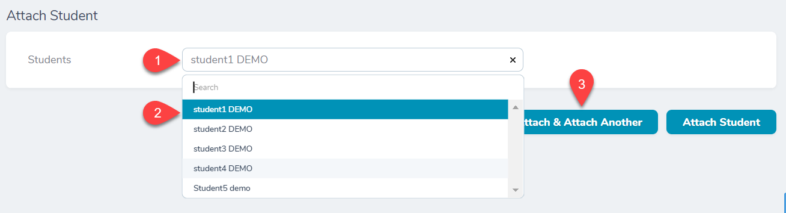

Students assigned to a team will be visible in the team's environment.

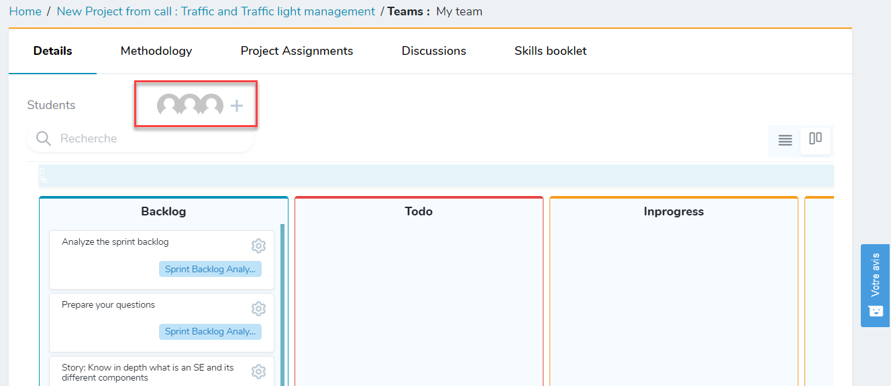

## Visualize a team's work

To access a team's environment, go to `teams` at the left menu, and click on any team from the list.

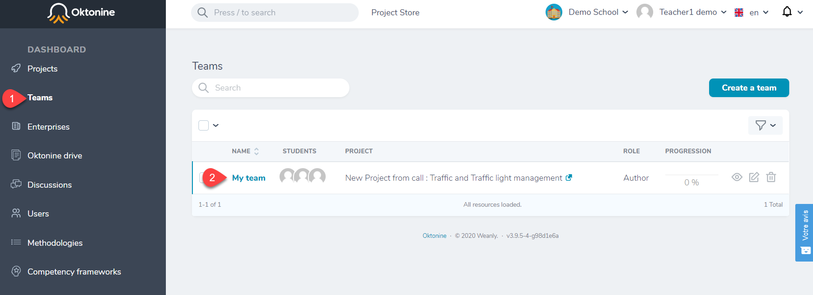

The team's environment looks like that : 

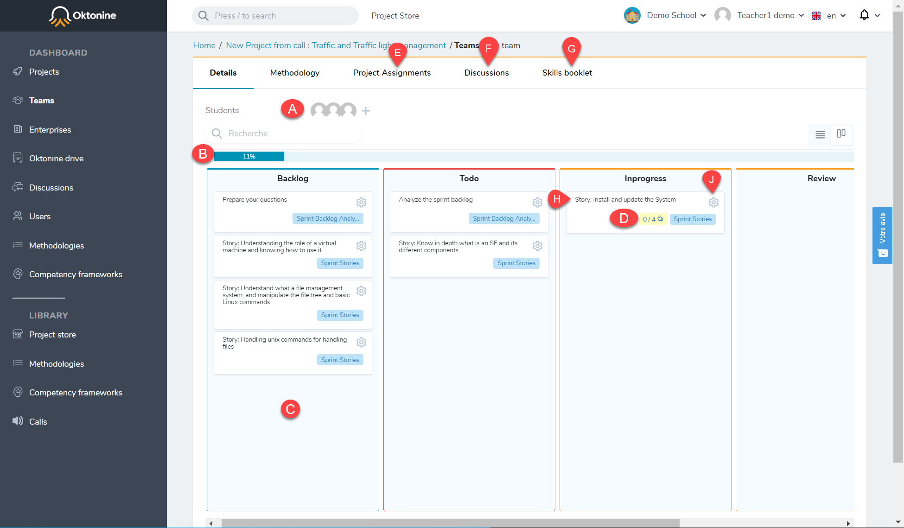

A: Team's students
B: Team's progression
C: Team's activities (issued from the methodology)
D: Number of competencies attached to an activity; by clicking on this icon, you can validate the acquired competencies.
E: Project delivrables (all the delivrables attached to the project's activities)
F: Discussions of the team
G: Competencies validated by the team (Register of competencies)
H: An activity issued from the methodology, with the state `In progress.`
J: By clicking on this icon, you can validate the acquired competencies 

## Competencies validation

To validate the competencies acquired within a specific activity, start by checking the team's deliverables within this activity. Check the boxes relative to 

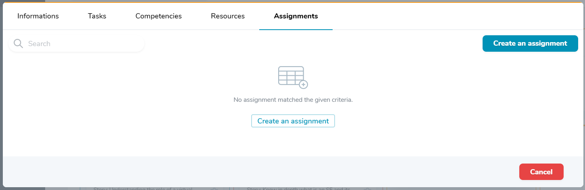

Then, open the competencies' validation space (**J: By clicking on this icon, you can validate the acquired competencies**).
Check the boxes related to the competencies you want to validate

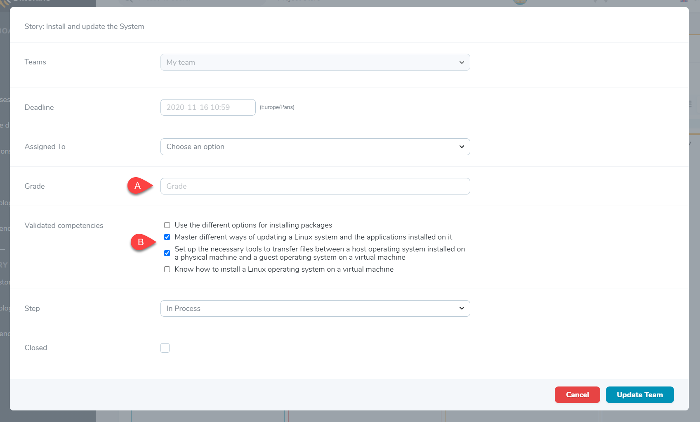

The validated competencies will be automatically added to the `register of competencies`

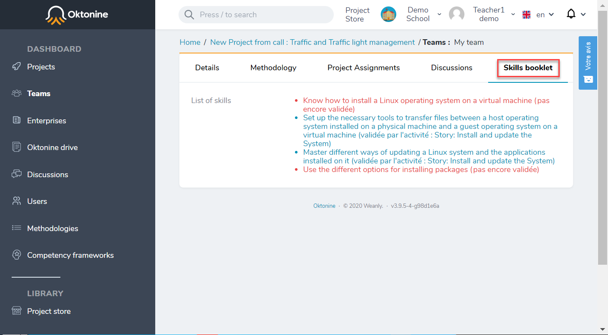
