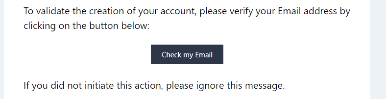
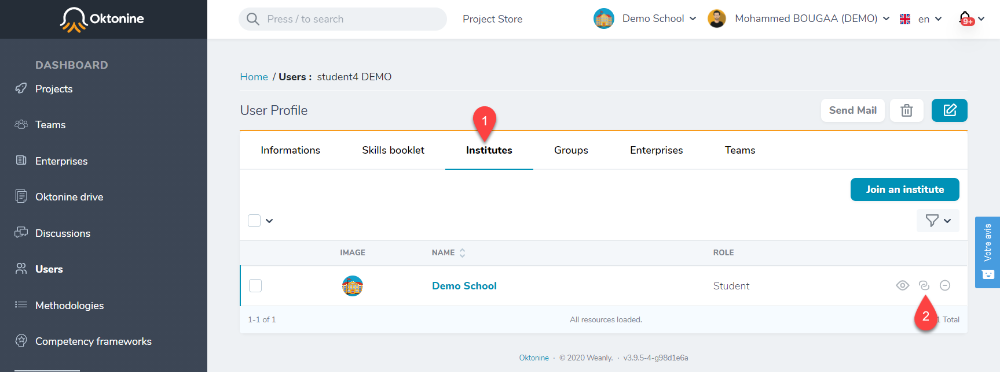

# Users management

In this section, you will learn how to create Oktonine accounts for students, teachers, and professionals (company's representatives)

## Student accounts
Students accounts need to be created by a school's manager or by a teacher. 

There are two methods for students accounts creation:

### 1- Creation via file import
To import a group of students : 
- Go to `Users` in the left menu and click on `Import students form an xlsx file`

- The file needs to respect the format that you can downlod from the next screen (First name ; Last name; Email	Password; Group; Department). 

- Upload the file, select your institution and click on "Create Batch of Students"

- If the operation is successfully executed, you'll receive confirmation emails and you will get a screen like that :

- You can verify this operation results by clicking on the `Users` element, from the left menu

- To give students access to their accounts, you can either communicate the defined passwords individually, or by asking them to click on Forgotten password (to define a new password before the first authentification)

Note : By creating students using the file import operation, they will be automatically attached to your institute.

### 2- Manual creation
You can also create an account for a student manually, by following these steps:

- First, go to the `Users` element in the left menu, and click on `Create a user`

- Fill the form and click on `Creat User` if you only need to create one account or click on `Create and Add another` if you want to create more than one student

- The profil is created and you will get this window

At this level you only created a generic user and not a student profile. You need to attach the created user to your institute and to give him a student role.

- Click on `Institutes` then on `Join an institute` to attach the created student to your institute.

- Select your institute and the role you want to give the new user (student)

- Finally, you can check if the new user has been successfully attached to your institute

## Teachers

### Account creation by the manager of the institute
You can follow the same [2- Manual creation](./Users_accounts.md#students) to create a new account for a teacher manually. You only have to select the `teacher role` when you attach the new user to your institution.

### Account creation by the teacher itself
The other way we recommand is to ask for your teachers to directly create they accounts by following these steps :

- As a teacher, when you come to this page, you need to click on `Register`

- Click on `teacher`

- Fill the form and search for your institute in the last field. If your institute is not already registred at oktonine, or if you want to register it, please contact us.

- You get a message telling you that your account needs to be validated by the manager of your institute. 

- At the same time you will receive an email asking you to verify your email adress

- Click on `Check my Email`
- When your account is validated by the manager you should receive an email like that :

Note : If you don't receive any message from you institute within few days, we invite you to contact the manager of your institute.

### Accounts validation by the manager
When a teacher creates his account using the registration form, the manager of his institute receive a notification to activate the account.

As a manager, you need to go through these steps to validate a teacher account : 

- Open the teacher's profile 

- Click on `Activate`

- Validate the action

## Companies
A company representative/employee can creates an account in Oktonine, by following these steps:

- As a professionnal (a company representative), when you come to this page, you need to click on `Register`

- Click on `Professionnal`

- Fill the form and search for your company. If your company is not already registred at oktonine, use the last field to put its name.

- You get a message telling you that your account needs to be validated by Oktonine within 48 hours. 

- At the same time you will receive an email asking you to verify your email adress

- Click on `Check my Email`
- When your account is validated by oktonine you should receive an email like that :

Note : If you don't receive any message from us after this delay and if you can't access to your account, we invite you to contact us.

## Roles modification

As a manager you can modify a user's role within your institute, you can for exemple, make a teacher as a manager or a student as a teacher .

- Select and clicj on the user your need to modify

- Go to `Institute` then click on the attachment icone

- Select the new role from the list and update de User <--> Institute realation

