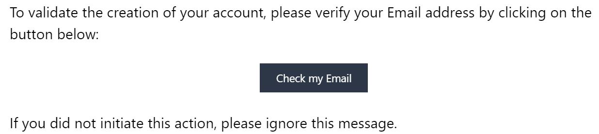
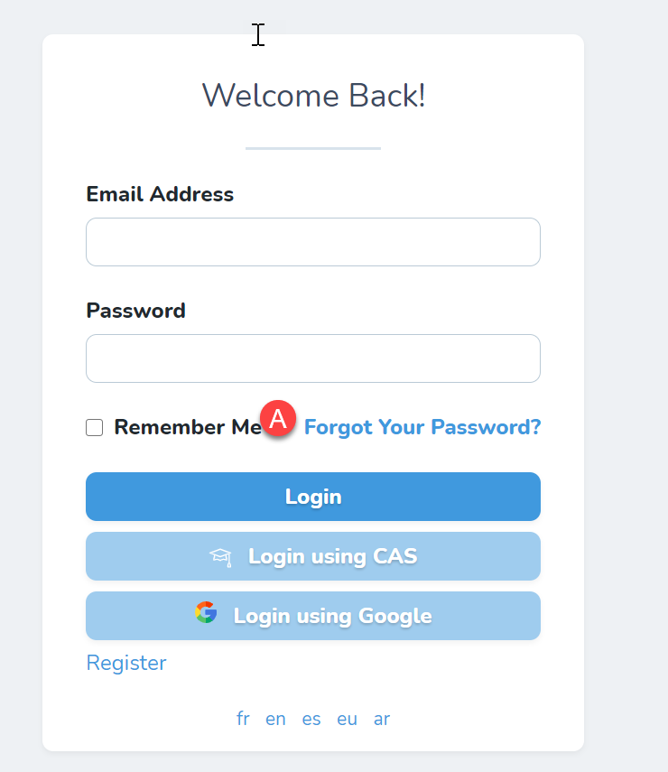
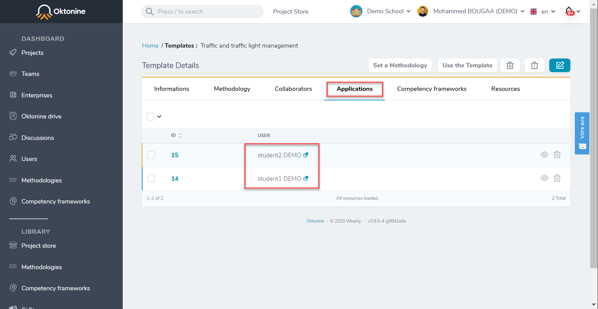
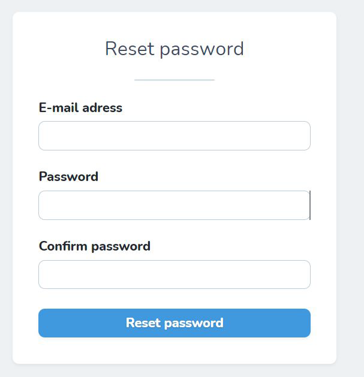

# Account creation

As a student you don't have to create your account within Oktonine.
Your account needs to be created by your teacher or your school representative

## First Access to your account

When your institution creates an account for you within oktonine, you receive an email welcoming you and asking to verify your email address.

Click on the link within this email to verify your address

Click then on, "Forgot Your Password?" to define your password for the first time.

You receive an email asking you to reset your password. Click on the link inside:

Provide a new password and validate your action

Then, return to your mail inbox, open the first email you received
Click on "Verify my email address"
Sign in with your email en your new password.

Welcome at Oktonine

## First access 
If you are using or demoing components that are not SSR friendly (for example containing custom directives), you can wrap them inside the built-in `<ClientOnly>` component:

