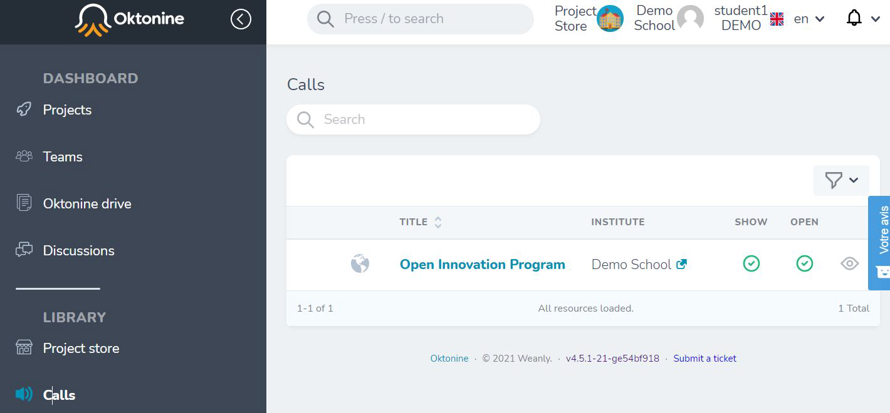
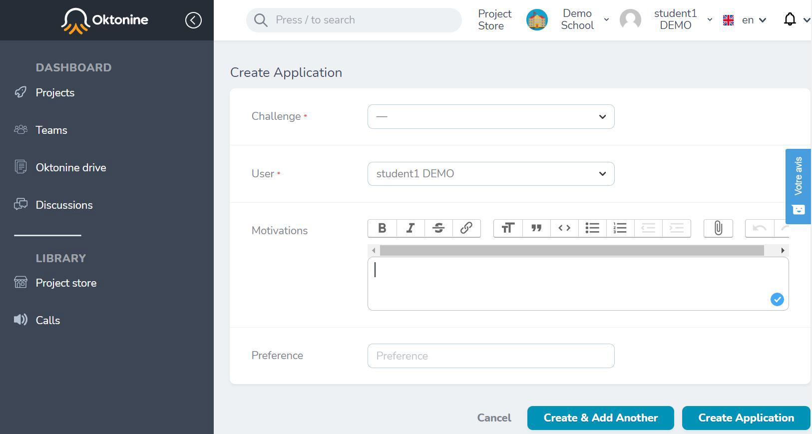

# Challenges and applications

Your teachers can ask companies to provide them with real life challenges.
At this section, you'll learn how to vizualize the received challenges for a specific call-for-challenges. You'll also learn how to apply to deferent challenges !

## Visualize challenges within a call-for-challenge
First, you need to click on "Calls" at the left menu, to see all the open call for challenges

Click on a specific call-for-challenges to open it, there is only one available here "Open Innovation Program"

Once the call is displayed, you can click on "Challenges" to visualize the received challenges.

By clicking on a challenge name, here "Traffic....", you can visualize the challenge details

Finally, click on "Add candidature" to inform your teachers and the company which provided the challenges, about you interest to work on it

Within one call-for-challenges, you can make several applications to different received challenges. You can classify (priorize) your applications, by using the "preference" field, and the motivation field to explain your motivation to work on each challenge.
