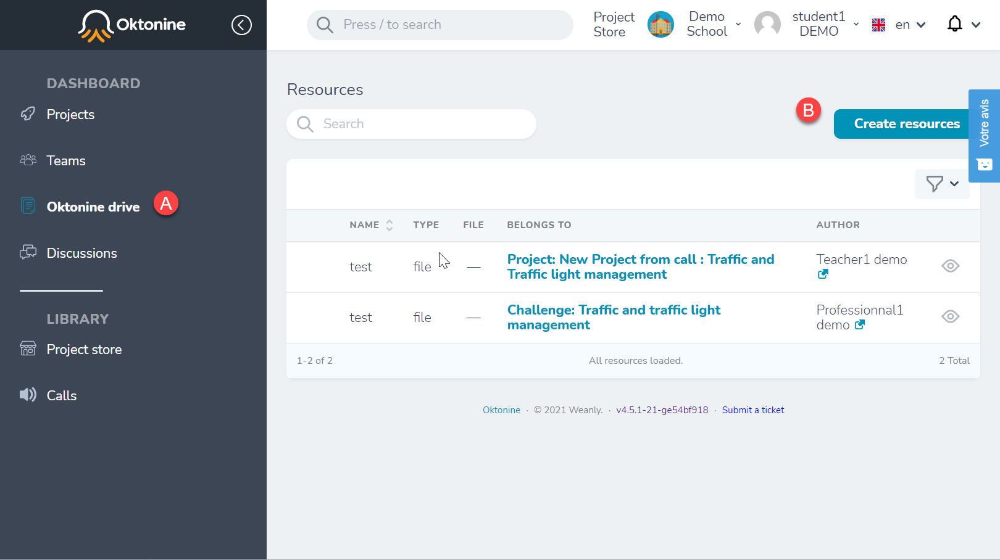
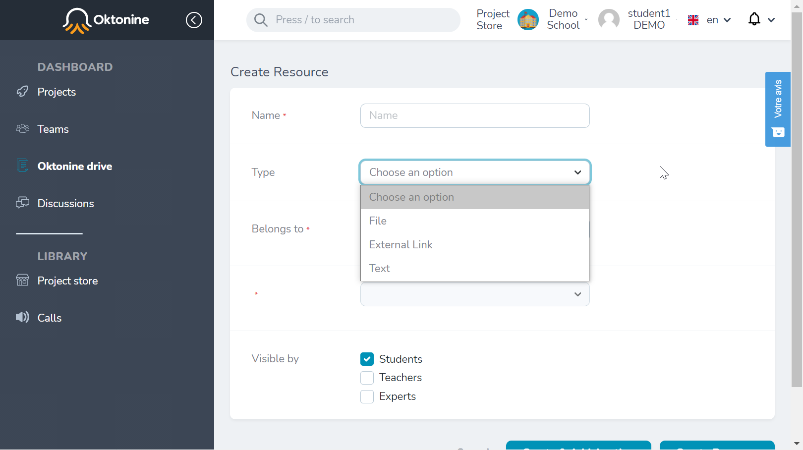
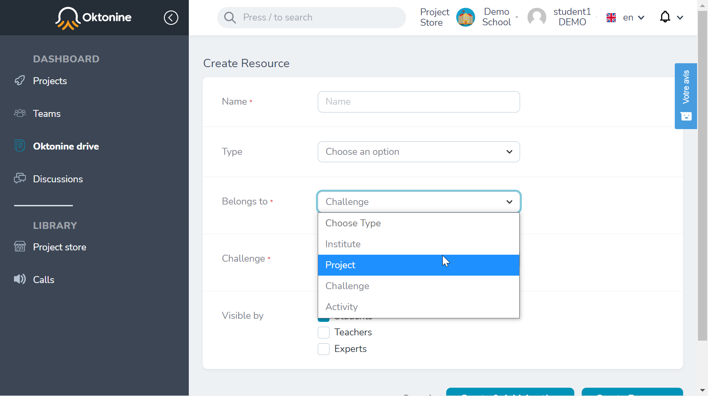

# Oktonine Drive

Within "Oktonine Drive", accessible through the left menu, you can find the different documents shared with you by your teachers and coachs
You can also share resources by clicking on "Create resources"

You can specify the nature of the resources you want to share (file, link, or text) : 

You can specify the audiance (institution, challenge, project, or activity)

And finally, users types addressed by the resources (students, teachers, and/or companies representatives)

