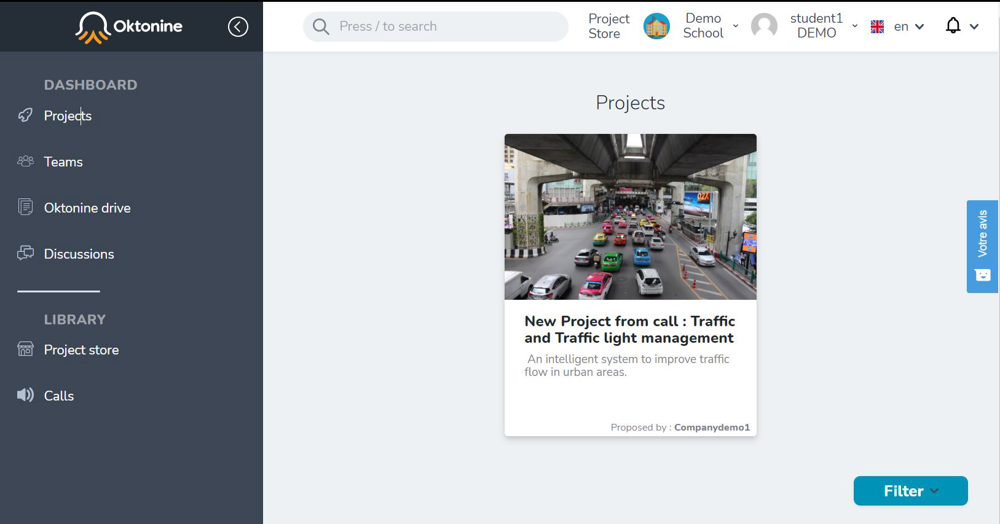
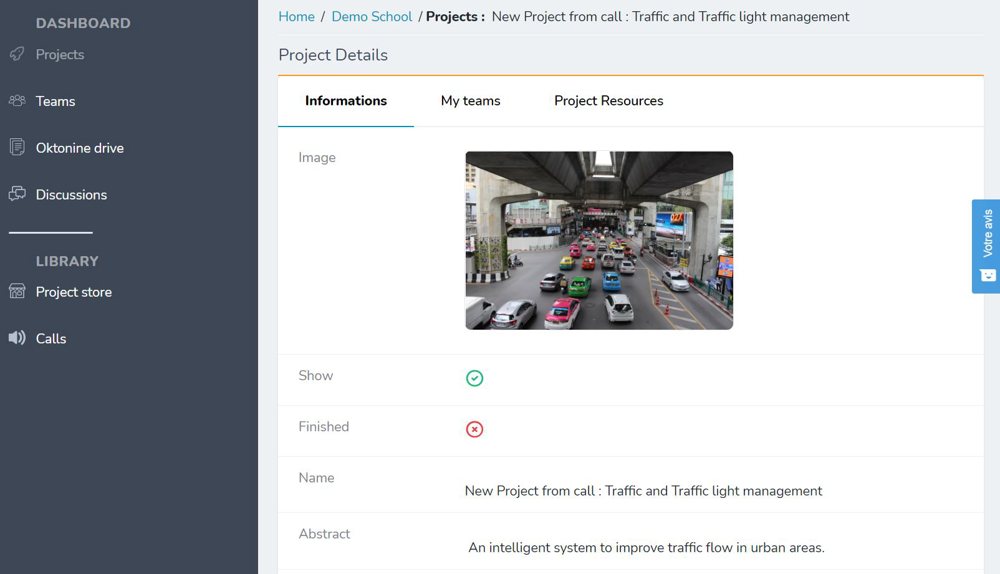
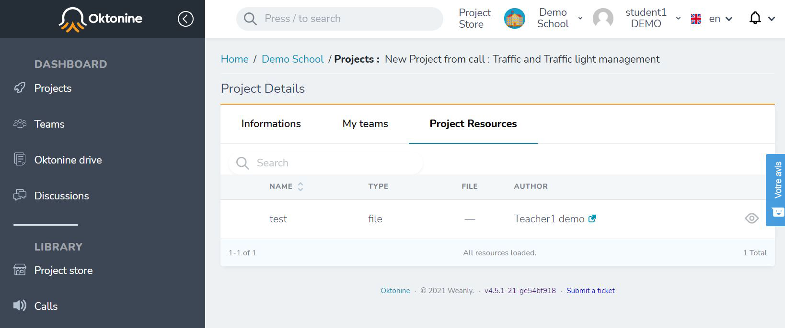
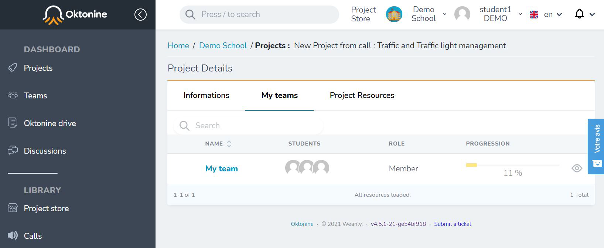
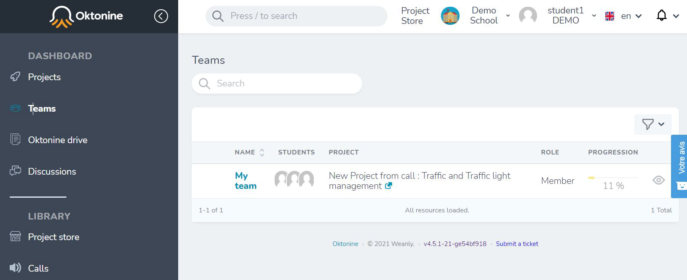

# Your projects and teams

## Find your projects
By clicking on "Projects" at the left menu, you will find all the projects you are working on.

To open a project's space, just click on its title 

You can access to the different resources attached to your projet, through the "resources" tab of the project.

## Find your teams

By clicking on the "Teams" tab you can get access to your team workspace, dedicated to this project.

You can also visualize all the teams you are part of, from the "Teams" left menu

