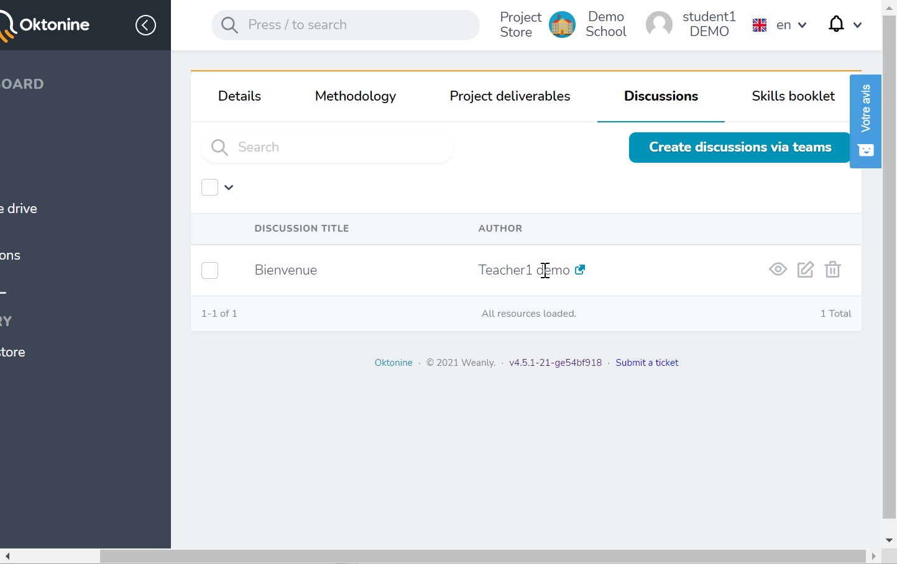

# Discussions

## Using the menu

To start a discussion with all the students of your institution, your teachers, and/or companies representatives, go to "Discussions" element from the left menu.
Then, click on "Create a discussion"

Specify if you want to start a discussion with one of your teams, or with all the institution

Specify then your specific recipients, among students, teachers and companies

## From the team's workspace

You can also start a discussion directly within your team's workspace, by clicking on the "Discussions" tab.

