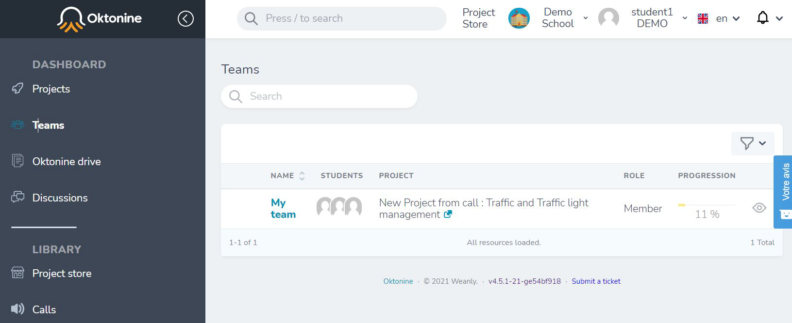
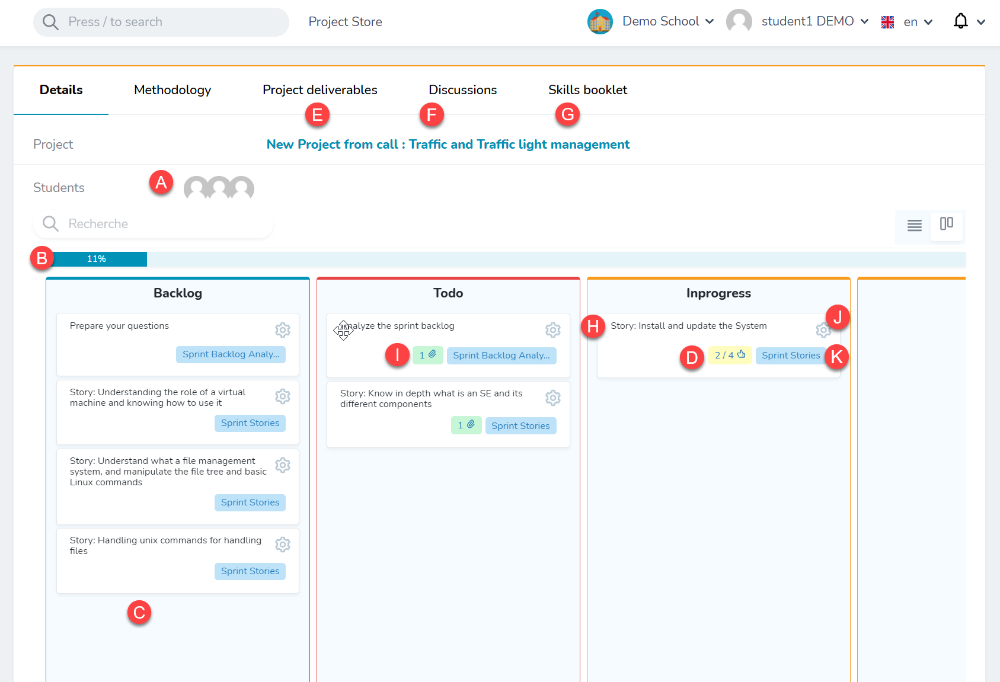
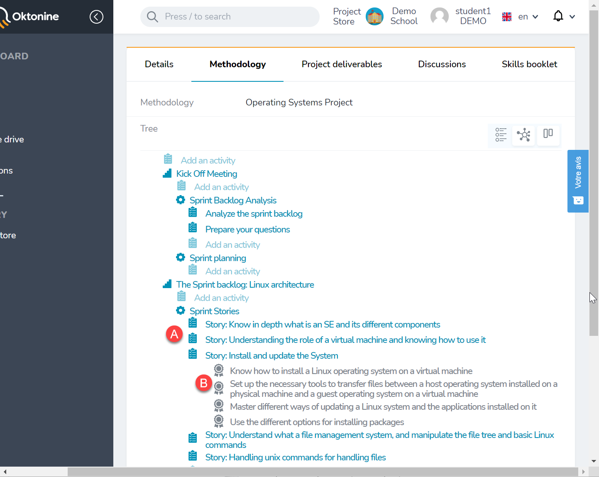
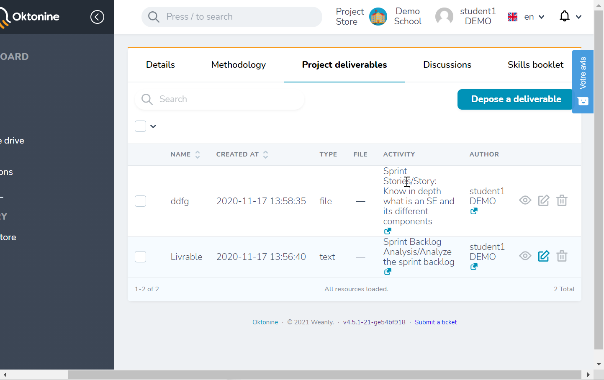
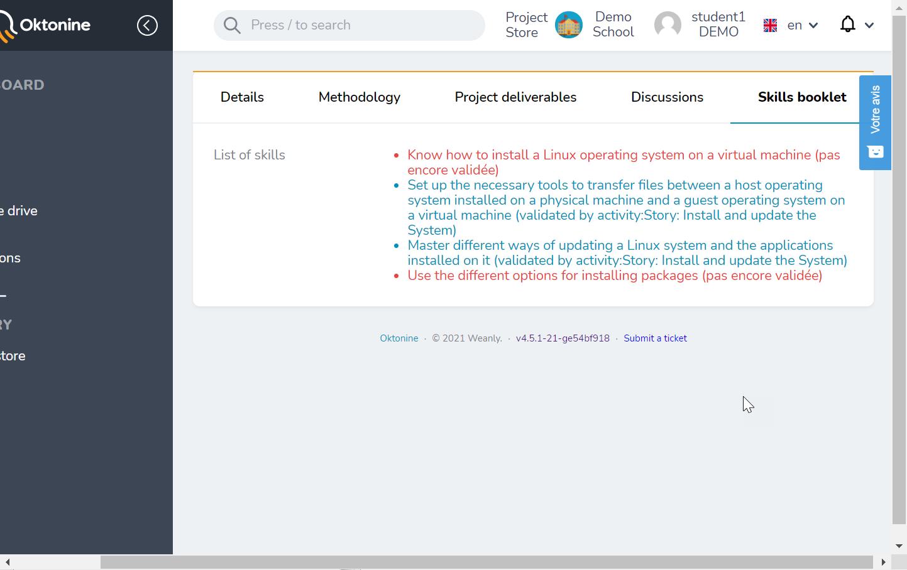
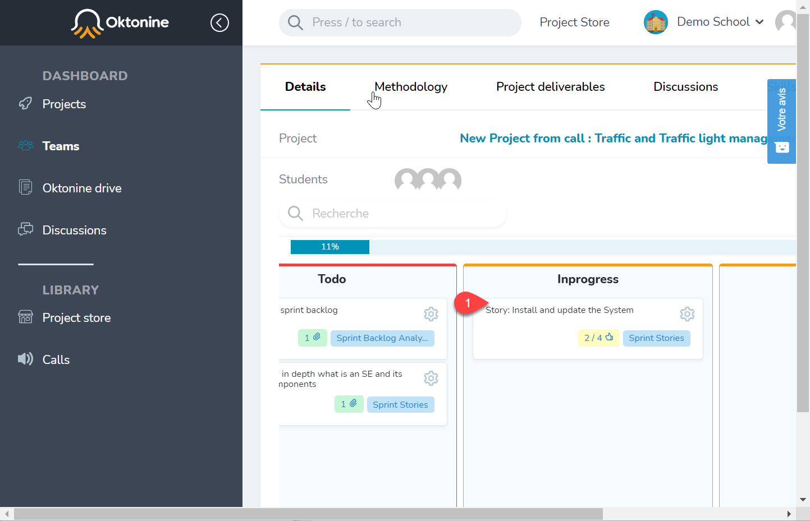
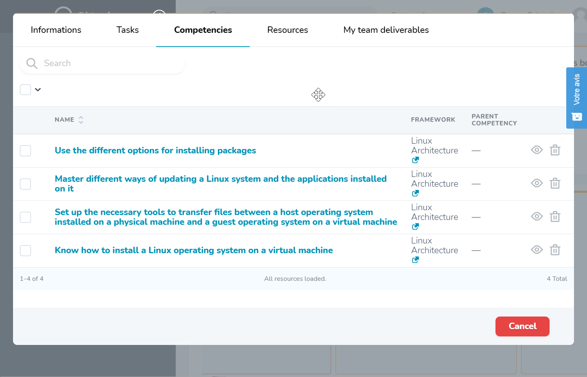
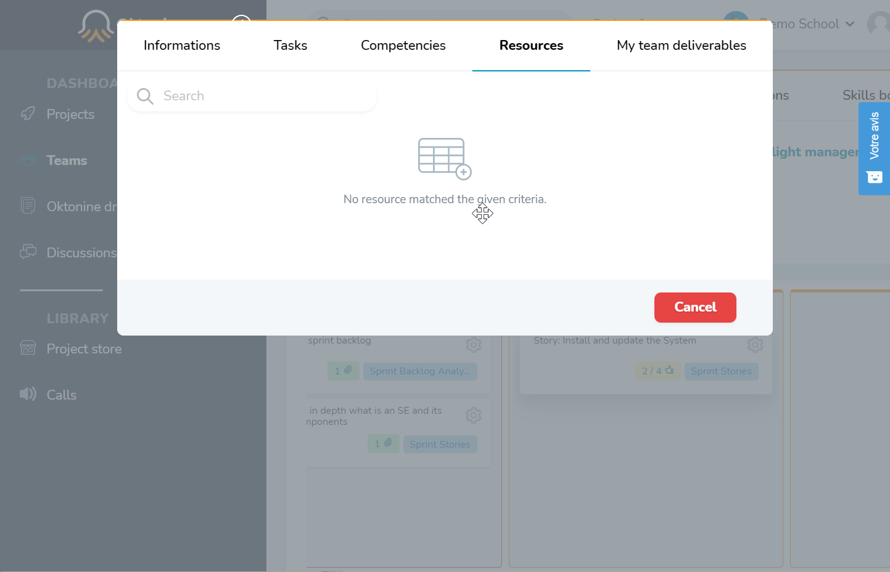
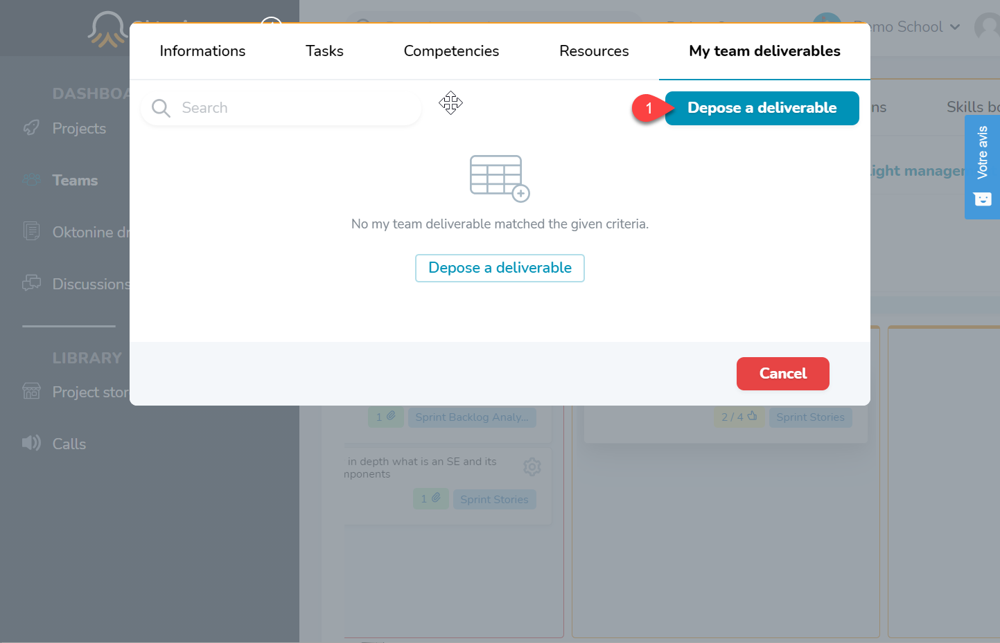
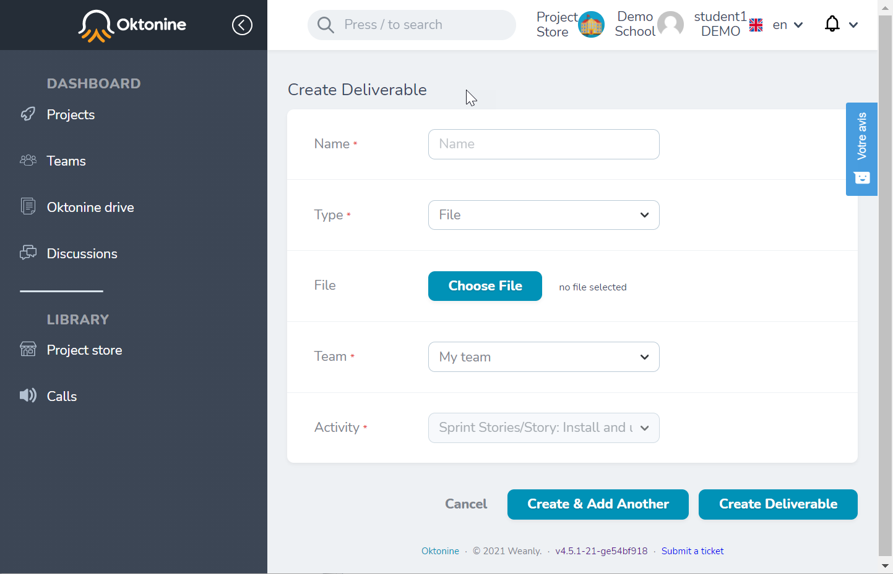

# My workspace

## My teams

You can visualize all the teams you are part of, from the "Teams" element of the left menu

## Understand the team's workspace

By clicking on a specific team, its workspace will be displayed

These are the most relevant elements of the team's workspace

A: Team's members (students)
B: Team's progression
C: Team's activities (issued from the methodology)
D: Number of competencies attached to an activity; by clicking on this icon, you can validate the acquired competencies.
E: Project delivrables (all the delivrables attached to the project's activities)
F: Discussions of the team
G: Competencies validated by the team (Register of competencies)
H: An activity issued from the methodology, with the state "In progress".
I: Number of deliverables uploaded by students within this activity
J: By clicking on this icon, you can validate the acquired competencies
K: The process (step) this activity is part of

### Visualize the team/project methodology

By clicking on the "Methodology" tab, you can visualize the methodology you need to folow, in order to perform your project. You can add activities to each level of the methodology, by you are not able to delete existing activities, processes and stages.

### Project deliverables

All the deliverables uploaded by your team for this project (within the different activities of the methodology), are grouped at the "Project deliverables" tab.

### Acquired skills

Here you can check skills you already acquired and those to be acquired within the project

## Activity related actions

Click on the Activity title to open it

### Attached competencies

You can then check the competencies associated to the activity (competencies you will acquire if you correctly perform the activity)

### Attached resources

You can also check if activity specific resources are added by your teachers and coachs

### Upload a delivrable

To upload a deliverable (an activity outcome), click on "depose a deliverable"

Then, specify the information related to the deliverable you want to upload

